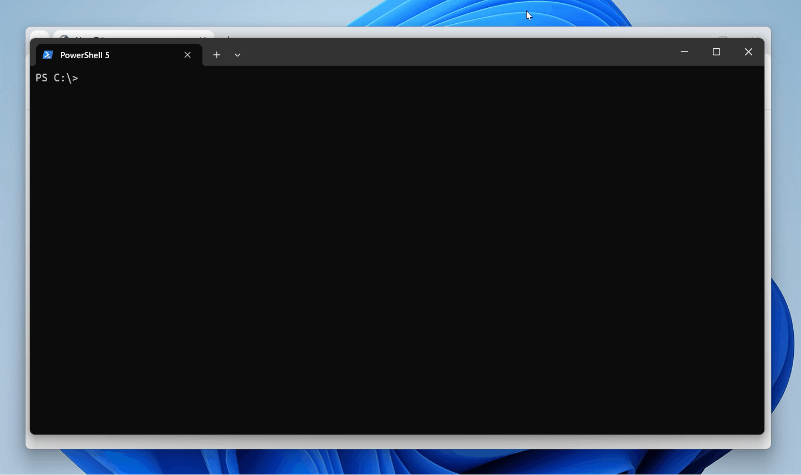
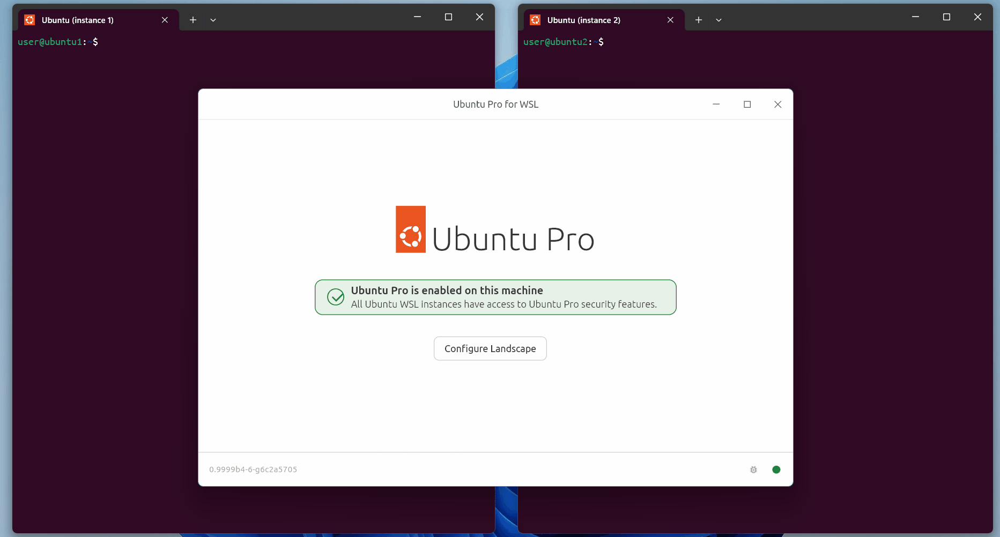

# Ubuntu on WSL and Ubuntu Pro for WSL

[](https://canonical-ubuntu-pro-for-wsl.readthedocs-hosted.com/en/latest/?badge=latest)
[](https://github.com/canonical/ubuntu-pro-for-wsl/actions/workflows/qa.yaml?query=event%3Apush)
[](https://codecov.io/gh/canonical/ubuntu-pro-for-wsl)
[](LICENSE)

## Contents

1. [Ubuntu on WSL](#ubuntu-on-wsl)  
2. [Ubuntu Pro for WSL](#ubuntu-pro-for-wsl)  
3. [Basic usage of Ubuntu on WSL](#basic-usage-of-ubuntu-on-wsl)  
4. [Basic usage of Ubuntu Pro for WSL](#basic-usage-of-ubuntu-pro-for-wsl)  
5. [System components of the Pro for WSL app](#system-components-of-the-pro-for-wsl-app)  
6. [Documentation](#documentation)  
7. [Contribute](#contribute)  
8. [Project and community](#project-and-community)


## Ubuntu on WSL

<p align="center">
  <a href="https://documentation.ubuntu.com/wsl/stable/tutorials/develop-with-ubuntu-wsl/">Develop with Ubuntu on WSL</a> •
  <a href="https://documentation.ubuntu.com/wsl/stable/howto/cloud-init/">Automatic setup of Ubuntu on WSL with Cloud init</a> •
  <a href="https://documentation.ubuntu.com/wsl/stable/howto/gpu-cuda/">Enabling GPU acceleration with CUDA</a>
</p>

**Ubuntu on WSL** provides a fully-functional Ubuntu terminal environment on
Windows. It's a lightweight and performant alternative to other methods of
using Ubuntu on Windows, such as dual-booting or conventional virtual machines.
With built-in developer tooling and excellent interoperability with the host
OS, it's a fast way of setting up a powerful development environment.



## Ubuntu Pro for WSL

<p align="center">
  <a href="https://documentation.ubuntu.com/wsl/stable/tutorials/getting-started-with-up4w/">Get started with Ubuntu Pro for WSL</a> •
  <a href="https://documentation.ubuntu.com/wsl/stable/howto/enforce-agent-startup-remotely-registry/">Remotely enforce startup of Pro agent</a> •
  <a href="https://ubuntu.com/pro/subscribe">Get an Ubuntu Pro subscription</a>
</p>

**Ubuntu Pro for WSL** is a separate Windows application that automates the
attachment of your Ubuntu Pro subscription. It solves the problem of needing to
manually Pro-attach each new Ubuntu instance created on a Windows machine when
you want the security benefits of Ubuntu Pro. For organisations, it enables
automated Pro-attachment at scale for fleets of devices.



## Basic usage of Ubuntu on WSL

Ubuntu distros can be installed on Windows by running the following command in PowerShell:

```
wsl --install <Ubuntu distro>
```

> [!NOTE]
> When you install and enable WSL for the first time,
> the latest Ubuntu LTS release is installed as "Ubuntu".


To see the Ubuntu distros available to install, run:

```
wsl --list --online
```

To list what Ubuntu instances are installed and available to run on your machine:

```
wsl -l -v
```

To open a specific instance of Ubuntu on WSL in its home directory:

```
wsl ~ -d <Instance name>
```

Then you can use that instance just like any other Ubuntu machine, for writing
code, running scripts, and even [opening Linux GUI
apps](https://documentation.ubuntu.com/wsl/stable/howto/data-science-and-engineering/).

## Basic usage of Ubuntu Pro for WSL

Find and install the Ubuntu Pro for WSL application in the Microsoft Store.

After installation, open the application and enter your Ubuntu Pro token.

> [!TIP]
> You can get [free Pro subscription for up to 5 machines](https://ubuntu.com/pro/subscribe).

Now, all instance of Ubuntu on WSL will be automatically Pro-attached on your machine.

You can confirm this in any Ubuntu instance with:

```
pro status
```

## System components of the Ubuntu Pro for WSL app

This repository contains the source code for Ubuntu Pro for WSL.

The application consists of the following components:

* A Windows MSIX package, consisting of an agent with its user interface. See [Windows Agent](windows-agent/README.md).
* An Ubuntu WSL Pro Service and its associated API, which controls the Pro and Landscape status between the agent running on Windows and the WSL instance. See [WSL Pro Service](wsl-pro-service/README.md).
* An interface between the agent and Ubuntu Pro, to handle the transactions with the contract server.
* An interface between the agent and Landscape, to manage the WSL instances from Landscape.
* A WSL management API, which controls the lifecycle of the WSL instances, like provisioning, updates, and starting or stopping the WSL instances.

## Documentation

Our [official documentation](https://documentation.ubuntu.com/wsl/stable/)
includes tutorials, guides, references, and explanations on both:

* The Ubuntu on WSL distribution
* The Ubuntu Pro for WSL application

Documentation is maintained in the `docs` directory of this repository. It is
written in markdown, built with Sphinx, and published on [Read the
Docs](https://about.readthedocs.com/).

## Contribute

This is an [open source](LICENSE) project and we warmly welcome community contributions, suggestions, and constructive feedback. If you're interested in contributing, please take a look at our [Contribution guidelines](CONTRIBUTING.md) first.

* To report a bug, please create a new issue in this repository, using the Report an issue template.
* For suggestions and constructive feedback, use the Request a feature template.

## Project and community

We're friendly! We have a community forum at [https://discourse.ubuntu.com](https://discourse.ubuntu.com) where we discuss feature plans, development news, issues, updates and troubleshooting.

For news and updates, follow the [Ubuntu twitter account](https://twitter.com/ubuntu) and on [Facebook](https://www.facebook.com/ubuntu).
