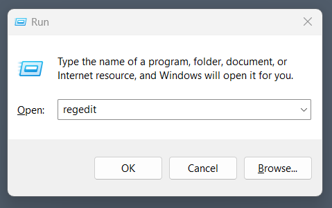
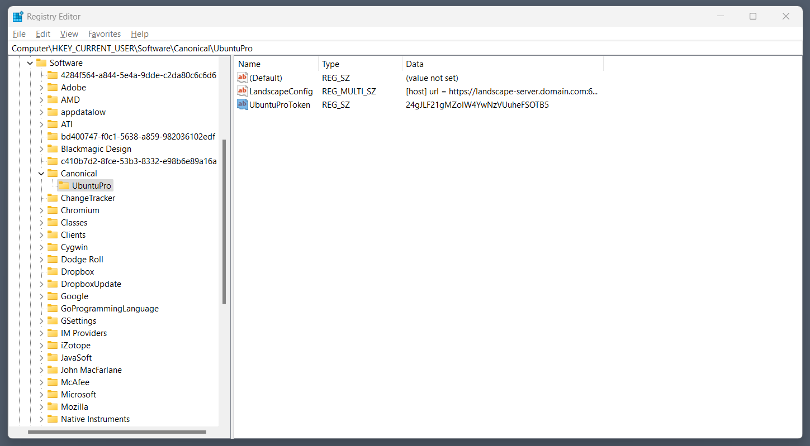

---
myst:
  html_meta:
    "description lang=en":
      "The Landscape client in Ubuntu on WSL instances can be configured with Ubuntu Pro for WSL to support remote management and deployment."
---

# Configure the Landscape client with Ubuntu Pro for WSL

```{include} ../pro_content_notice.txt
    :start-after: <!-- Include start pro -->
    :end-before: <!-- Include end pro -->
```

(howto::config-landscape)=
## Choose a configuration method

The Landscape client can be configured in two ways:

- Windows registry: easier to automate and deploy at scale 
- Graphical Windows application: convenient option for individual users

Click the appropriate tab to read more.

````{tabs}

```{group-tab} Windows registry

## Access the registry

First, ensure that UP4W has run at least once after installation.
This ensures that the key and values necessary for configuration will be set up
in the registry.

Advanced users of the registry can find relevant information in the
[Microsoft documentation](https://learn.microsoft.com/en-us/troubleshoot/windows-server/performance/windows-registry-advanced-users)
about alternative methods for modifying the registry data.

To open the registry type `Win+R` and enter `regedit`:

 

## Configure Landscape in the registry

If you are using Landscape you can input your configuration in `LandscapeConfig > Modify > Write the Landscape config`:

 

Refer to the section on [Landscape client configuration](howto::config-landscape-client) for an example.

After you have populated the configuration with data you should be ready to create and manage 
automatically Pro-attaching WSL instances through Landscape:

 

```

```{group-tab} Graphical Windows application
In the UP4W app navigate to the Landscape configuration screen:


Choose your preferred configuration option and enter the required details.

The "Advanced Configuration" option requires you to specify a `landscape.conf`.
Refer to the section on [Landscape client configuration](howto::config-landscape-client) for an example.

When you continue a status screen will appear confirming that configuration is complete:


```

````

```{warning}
Until version 0.1.15 of Ubuntu Pro for WSL, the app explicitly requires referencing a path
to the SSL certificate on a Windows host machine.
Newer versions completely follow the Windows OS certificate stores, only requiring reference
to that certificate if the machine running the Landscape server is not trusted on your network.

For example, if you followed the [Landscape Quickstart](https://ubuntu.com/landscape/docs/quickstart-deployment)
installation, the auto-generated self-signed certificate can be found at `/etc/ssl/certs/landscape_server.pem`.

This can be copied to a Windows machine:

>  C:\Users\\<YOUR_WINDOWS_USER_NAME>\landscape_server.pem

The path can then be referenced during Landscape configuration in the UP4W Windows app.
```

(howto::config-landscape-client)=
## Configuring the landscape client

Both the `LandscapeConfig` data in the Windows registry and the Advanced Configuration
option in the graphical Windows application can be configured as follows:


```ini
[host]
url = landscape-server.domain.com:6554

[client]
url = https://landscape-server.domain.com/message-system
ping_url  = http://landscape-server.domain.com/ping
account_name = standalone
log_level = debug
ssl_public_key = C:\Users\user\Downloads\landscape_server.pem
```

```{warning}
The `ping_url` must be a `http` address. A `https` address will not work.
```

A more comprehensive example of the configuration options is provided [here](https://github.com/canonical/landscape-client/blob/main/example.conf).
