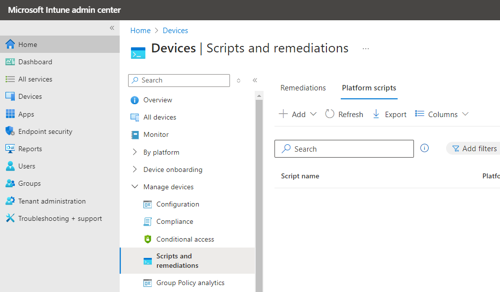

---
myst:
  html_meta:
    "description lang=en":
      "Use Intune to enforce startup of the Ubuntu Pro for WSL background agent to support zero-touch deployment at scale."
---

# Start the Ubuntu Pro for WSL background agent remotely with Intune

```{include} ../includes/pro_content_notice.txt
    :start-after: <!-- Include start pro -->
    :end-before: <!-- Include end pro -->
```

Ubuntu Pro for WSL, being a Microsoft Store application, cannot ship user services as of the time of writing (late
2024), but can deploy startup tasks instead, programs that run with user permissions when the user logs into the
Windows device. The UP4W background agent runs as a startup task, which is only enabled by the
operating system when the user interacts with the application for the first time. While this behaviour is a feature for
end-users it presents a source of friction for deployments at scale, when system administrators expect zero-touch
deployment of UP4W to just work.

This guide shows how system administrators can leverage Windows remote management solutions to start the UP4W background agent once
with user credentials, thus interacting with the application on the user's behalf. Subsequent logins will have the UP4W
background agent started automatically as a consequence of the interaction.

While this guide uses Intune, readers can translate the steps for the remote management solution of their
choice, as long as the said solution can run scripts with current user's credentials.

## Pre-requisites

- At least one managed Windows device.
- A Windows remote management solution.

## Overview

1. Running a script as user to start the UP4W background agent makes it immediately available.
2. Remote management solutions can be used to start the agent.
3. The startup task is then also enabled on the operating system.
4. On subsequent logins, the UP4W background agent starts automatically, as expected.

## Using Intune to run the UP4W background agent

The contents of the script can be far more elaborate, but for the purposes of this guide the following is enough:

```powershell
Write-Output "Starting the UP4W background agent remotely from Intune"
ubuntu-pro-agent.exe
```
**Make sure to save that as UTF-8**, as required by Intune.

```{note}
Follow [this section from Intune documentation](https://learn.microsoft.com/en-us/mem/intune/apps/intune-management-extension#create-a-script-policy-and-assign-it)
if you need more detailed step-by-step guide on how to create and assign script policies.
```

Access your organisation's [Intune Admin Center](https://intune.microsoft.com) and when logged in go to **Devices > Monitor > Manage Devices > Scripts and remediations**.
On that page, click on the **Platform scripts** tab.


Click on the "Add" button to create a new script policy and select the platform **Windows 10 and later**.

Fill in the **Basics** form with a name and description for the script being created.

In the **Settings** tab, browse your machine to the PowerShell script to be deployed, and select the following options:
- Run this script using the logged on credentials: Yes (the default). UP4W must run with user credentials.
- Enforce script signature check: No (unless required otherwise by your company's policies).
- Run script in 64-bit PowerShell host: No (the default).

Apply the "Scope tags" according to your company's practices and, in "Assignments" make sure to select one or more
groups encompassing the users that must receive and run the script.

You can then monitor the execution of this script in the Intune Admin Center.

When the selected users log in to their devices, Intune will eventually start the UP4W background agent. A terminal window
will appear to the user showing its regular outputs. This will only happen once.

## Remarks

Careful readers might have noticed that if the script is deployed in conjunction with a policy installing the UP4W, it
would be theoretically possible to have the script running before the application gets installed. A more elaborate
solution is required if that scenario is possible, like looping in the script or using a more proactive solution such as
[Intune Remediations](https://learn.microsoft.com/en-us/mem/intune/fundamentals/remediations).

[This guide](howto::enforce-with-intune) shows how to use that tool to enforce the UP4W startup task state.

