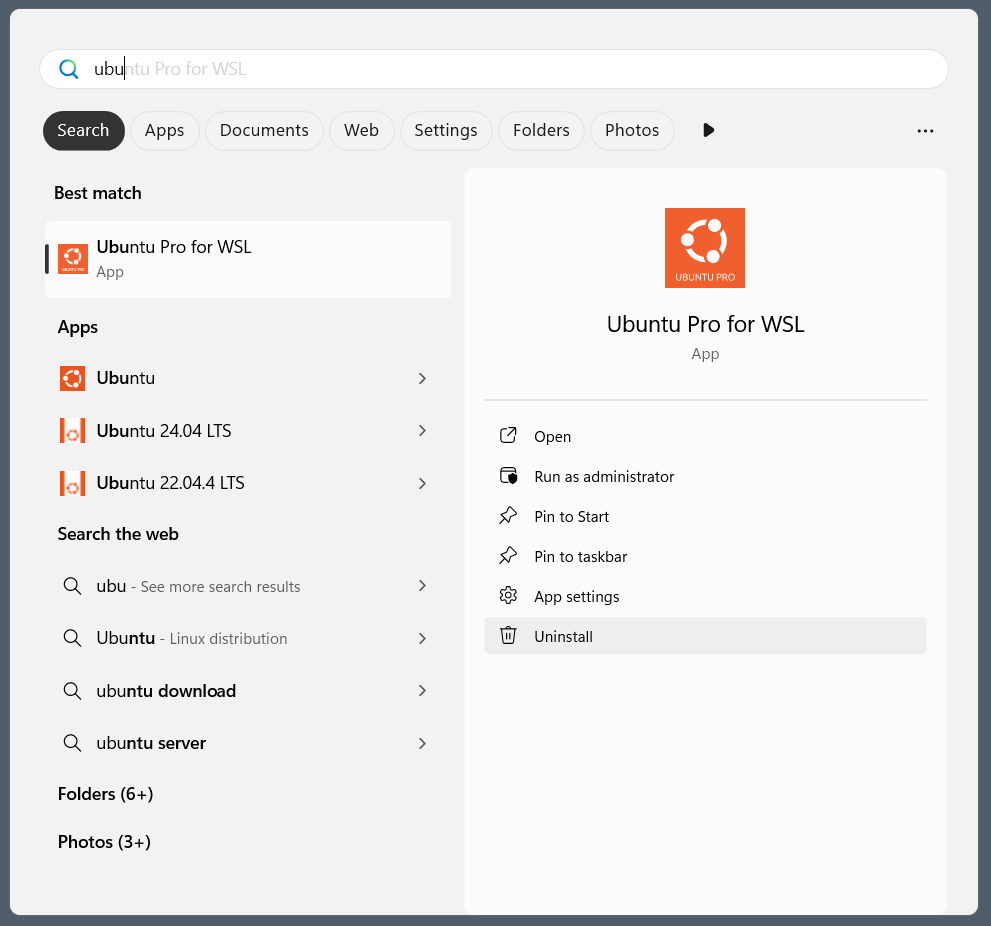

---
myst:
  html_meta:
    "description lang=en":
      "Follow the steps to uninstall the Ubuntu Pro for WSL Windows application, Ubuntu on WSL instances and WSL itself."
---

# Uninstall Ubuntu Pro for WSL, Ubuntu on WSL and WSL

Uninstalling UP4W, Ubuntu WSL apps and WSL generally only requires finding
the relevant application in the Windows Start Menu and clicking **Uninstall**,
although in some cases a few additional steps are required.

(howto::uninstall-up4w)=
## UP4W

In the Windows Start Menu, locate the "Ubuntu Pro for WSL" application and right-click on it, then click **Uninstall**.



You should also remove the `.ubuntupro` directory from your Windows user profile directory.

```text
PS C:\Users\username> Remove-Item -Recurse -Force C:\Users\username\.ubuntupro
```

(howto::uninstall-ubuntu-wsl)=
## Ubuntu WSL apps

In PowerShell run the following command to stop WSL:

```text
PS C:\Users\username> wsl --shutdown
```

Then, in the Windows Start Menu, locate the "Ubuntu 24.04 LTS" application, right-click on it, and select "Uninstall".

The instances will be removed automatically.

(howto::uninstall-wsl)=
## WSL app

Only do this if you no longer need WSL on your Windows machine.

In the Windows Start Menu locate the "WSL" application, right-click on it then select "Uninstall".
