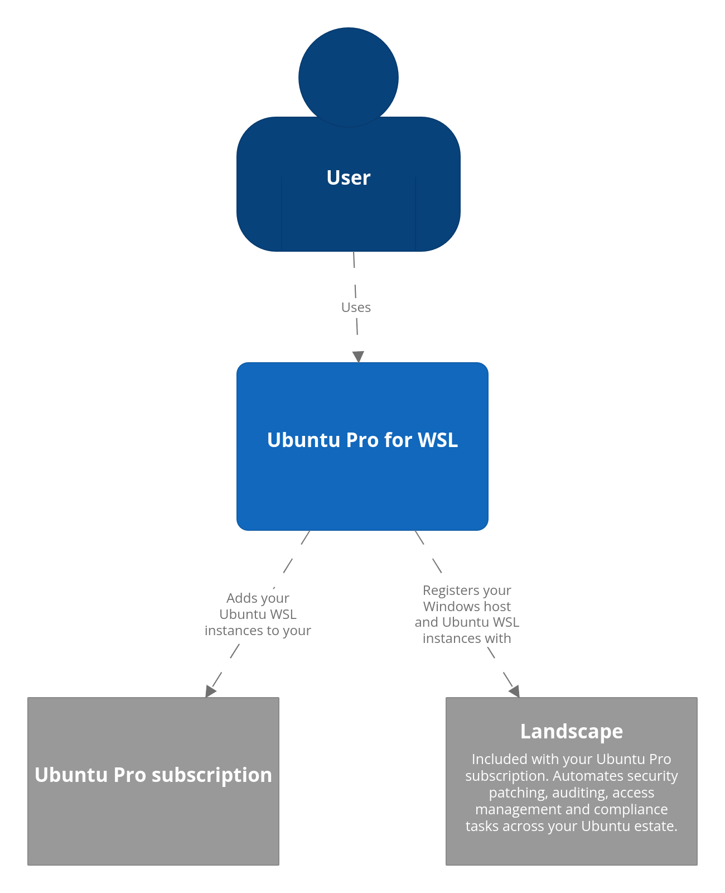

# Ubuntu Pro for WSL (UP4W)



Ubuntu Pro for WSL (UP4W) is a desktop application that facilitates access to Ubuntu Pro for Ubuntu WSL instances.

It allows you to add your Ubuntu Pro subscription to your Windows host. Once added, all Ubuntu WSL instances on that host are automatically attached and covered under your subscription too.

When you have a large Ubuntu WSL fleet, Pro-attaching each Ubuntu WSL instance manually can be a pain, but with Ubuntu Pro for WSL it’s a breeze – regardless of the size of your fleet.

Ubuntu Pro for WSL is of value to system administrators, corporate security teams and desktop users.

## Project and community

Ubuntu Pro for WSL is a member of the Ubuntu family. It’s an open source project that warmly welcomes community contributions, suggestions, fixes and constructive feedback. Check out our [contribution page](https://github.com/canonical/ubuntu-pro-for-wsl/blob/main/CONTRIBUTING.md) on GitHub in order to bring ideas, report bugs, participate in discussions, and much more!

Thinking about using Ubuntu Pro for WSL for your next project? Get in touch!

```{toctree}
:hidden:
:titlesonly:

self
How-to guides </howto/index>
Reference </reference/index>
Developer documentation </dev/index>
```
