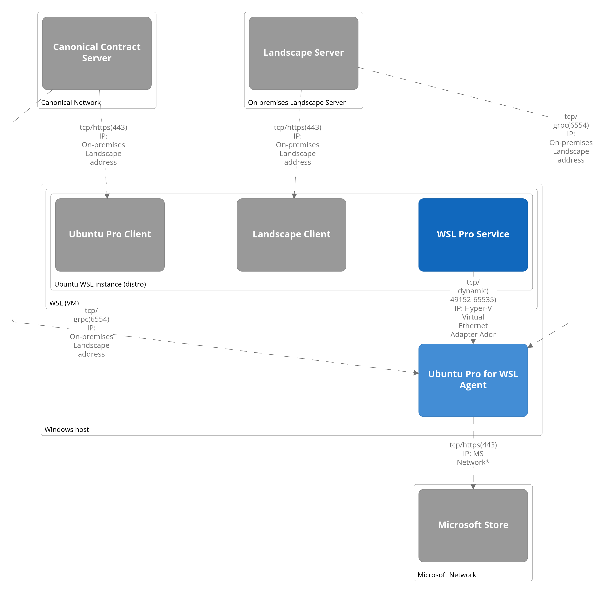

# Firewall requirements

Firewall rules must be configured for Ubuntu Pro for WSL to operate fully.

The following figure shows the possible connections between the different components and their default ports and protocols.

The following table lists the default ports and protocols used by Ubuntu Pro for WSL:

| Description | Client System | Server System | Protocol | Default Port | Target address |
|-------------|---------------|---------------|----------|--------------|----------------|
| Required for online installation of WSL instances.|Windows Host / Pro Agent|MS Store | tcp | 443 (https) | See [Microsoft documentation](https://learn.microsoft.com/en-us/microsoft-store/prerequisites-microsoft-store-for-business) for a list of addresses to allow. |
| Ubuntu Pro enablement |Windows Host / Pro Agent |Canonical Contract Server |tcp |443 (https) | contracts.canonical.com |
| Landscape management | Windows Host / Pro Agent | Landscape Server | tcp | 6554 (grpc) | On-premise Landscape address |
| WSL instance management on the Windows host. Firewall rules set up at installation time of the WSL Pro agent. | WSL Instance / wsl-pro-service | Windows Host / Pro Agent | tcp | 49152-65535 (dynamic) | Hyper-V Virtual Ethernet Adapter IP |
| Ubuntu Pro. For air-gapped installation refer to the [Ubuntu Pro documentation](https://canonical-ubuntu-pro-client.readthedocs-hosted.com/en/latest/explanations/using_pro_offline/). | WSL Instance / Ubuntu Pro client | Canonical Contract Server | tcp | 443 (https) | contracts.canonical.com |
| Landscape |  WSL Instance / Ubuntu Pro client | Landscape Server | tcp | 443 (https) | On-premise Landscape address |

> Access to the contract server and Landscape server is required for proper operation of Ubuntu Pro for WSL. If the client system is behind a proxy, ensure that the proxy is configured to allow the required connections.

> Access to the Microsoft Store is required for the online installation of WSL instances. Without it Ubuntu Pro for WSL will still be functional but it will not be possible to install WSL instances centrally from Landscape. In this case WSL instances have to be installed manually on the Windows hosts.
