# Landscape

Landscape is a systems management tool designed to help you manage and monitor your Ubuntu systems from a unified platform.
It is a separate project from Ubuntu Pro for WSL [with its own documentation](https://ubuntu.com/landscape/docs).

Ubuntu Pro for WSL offers a set of conveniences for using Landscape to manage WSL distros. This page explains how these two systems integrate.

WSL distros are incapable of performing certain actions that other Ubuntu flavours (server, desktop, etc.) can. These relate mainly to lifetime management: creating, removing, starting, and stopping themselves.

The [Windows Agent](./windows_agent.md) can perform these actions because it runs on the Windows operating system. Hence, Landscape's capabilities are split between those that must be performed by the Agent, and those that can be performed by the Landscape client within each distro. This client is the same one you'd use in other flavours of Ubuntu.

To configure Landscape, we need to configure the Agent as well as the Landscape Client running inside every distro. That would be inconvenient to do at scale, so instead you can input the configuration only once, and Ubuntu Pro for WSL will distribute it accordingly.

Here is a diagram showing how Ubuntu Pro for WSL interacts with Landscape:


## Managing WSL distros with Landscape

The Landscape server can manage the WSL distros once the Agent and the distros are configured. Refer to the Landscape documentation to learn how to set up a Landscape server and how to configure it.

(landscape-config)=

## Landscape configuration

This section details the configuration of Ubuntu Pro for WSL as it differs from other platforms. As in other platforms, Ubuntu Pro for WSL uses a `.ini` file to configure the client (both the Agent and Landscape Client).

This file contains two sections: host and client.

### Host section

This section contains a single key:

- `url` is the URL to the Landscape Hostagent API endpoint.

### Client section

This section is the same one you'd see in other Landscape platforms, with some changes:

- `ssl_public_key`: This key must be a Windows path. The WSL instances will have this path translated automatically.
- `computer_title`: This key will be used for the Agent. The WSL instances will use their Distro name as the title.
- `hostagent_uid`: This setting will be ignored and overridden.

All other data is ignored by the Agent and passed on verbatim to the Landscape client. You can see the reference for all the other keys in the [Landscape repository](https://github.com/canonical/landscape-client/blob/master/example.conf).

### Example

Here is an example of a self-hosted Landscape configuration:

```ini
[host]
url = https://landscape-server.domain.com/hostagent

[client]
url = https://landscape-server.domain.com/message-system
ping_url  = https://landscape-server.domain.com/ping
account_name = standalone
log_level = debug
```

## Read more

- [How to install Ubuntu Pro for WSL](../howto/install).

## External links

- [Landscape documentation](https://ubuntu.com/landscape/docs)
- [How to perform common tasks with WSL in Landscape](https://ubuntu.com/landscape/docs/perform-common-tasks-with-wsl-in-landscape).
