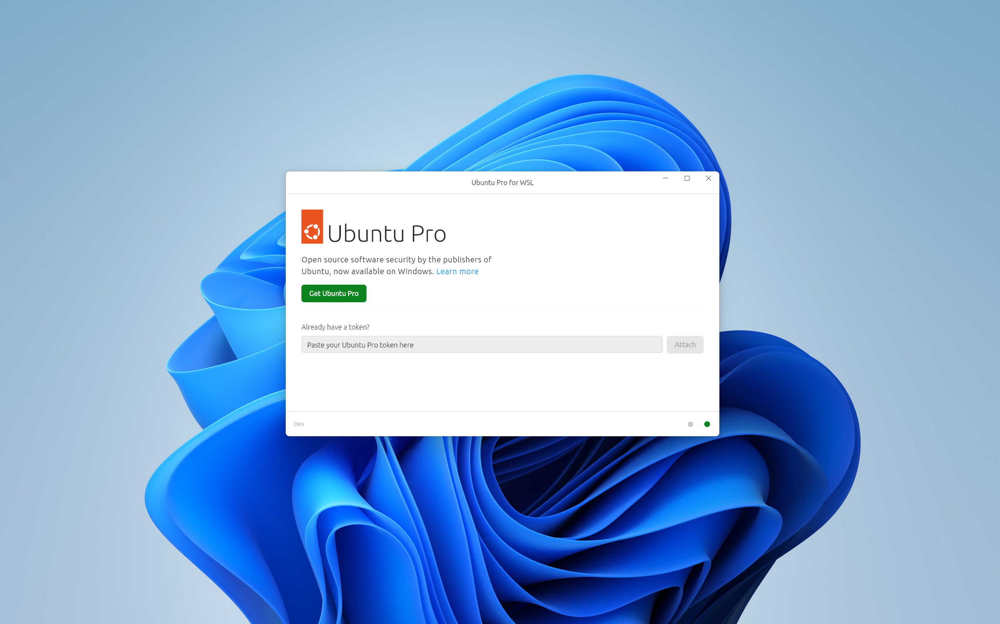

(ref::up4w-gui)=
# UP4W - GUI

Ubuntu Pro for WSL (UP4W) has a small Graphical User Interface (GUI) to help users with:
- Providing or acquiring an Ubuntu Pro token.
  > See more: [Ubuntu Pro token](ref::ubuntu-pro-token).
- Providing the Landscape configuration.
  > See more: [Landscape configuration](ref::landscape-config).

