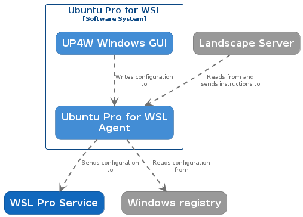

(ref::up4w-windows-agent)=
# UP4W - Windows Agent

UP4W's Windows Agent is a Windows application running in the background. It starts automatically when the user logs in to Windows. If it stops for some reason, it can also be started by launching the UP4W GUI.

The Windows agent is UP4W's central hub that communicates with all the components to coordinate them.

