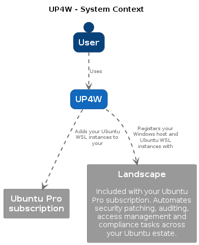

# Ubuntu Pro for WSL (UP4W)

Ubuntu Pro for WSL (UP4W) is an automation tool running on Windows hosts to manage Ubuntu WSL instances, providing them with compliance by attaching them to your Ubuntu Pro subscription and enrolling them into Landscape. 

Some Ubuntu Pro for WSL components run on the Windows host:
- the [UP4W Windows Agent](ref::up4w-windows-agent) providing automation services.
- the [UP4W GUI](ref::up4w-gui) for end users to manage their Ubuntu Pro subscription and Landscape configuration.

Additionally, Ubuntu Pro for WSL requires a component running inside each of the WSL distros:
- the [WSL Pro Service](ref::up4w-wsl-pro-service) communicates with the Windows Agent to provide automation services.

A top-level summary of the architecture is shown below:

