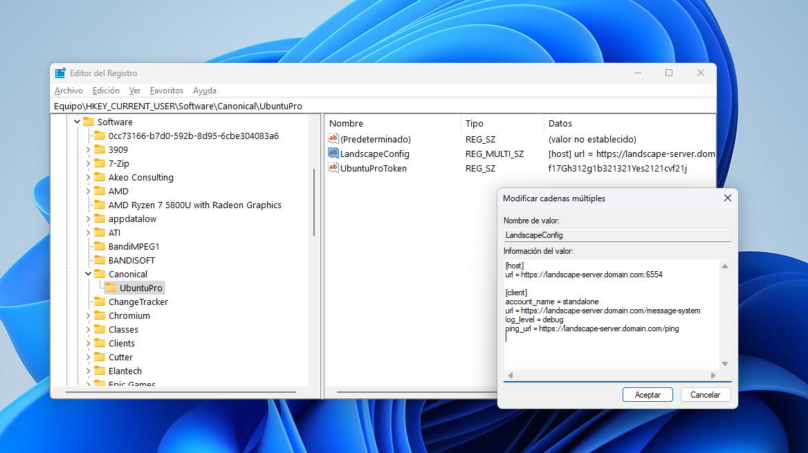

(windows-registry)=
# Windows registry

The Windows registry is a database provided by Windows where programs can read and write information. UP4W uses it as a read-only source of configuration.
> See more:
[Microsoft Learn | Windows registry information for advanced users](https://learn.microsoft.com/en-us/troubleshoot/windows-server/performance/windows-registry-advanced-users)

In UP4W, you can use the Windows registry to supply the configuration for [Ubuntu Pro](ref::ubuntu-pro) and [Landscape](ref::landscape) to the [Windows Agent](ref::up4w-windows-agent).

> See more: [install UP4W and add a Pro token](howto::config-up4w)

## Expected contents of the UbuntuPro registry key

The Windows agent will read the following values from the key at `HK_CURRENT_USER\Software\Canonical\UbuntuPro`:

- Value `UbuntuProToken` (type `String`) expects the [Ubuntu Pro token](ref::ubuntu-pro-token) for the user.

- Value `LandscapeConfig` (type `String` or `Multi-line string`) expects the [Landscape configuration](ref::landscape-config).
