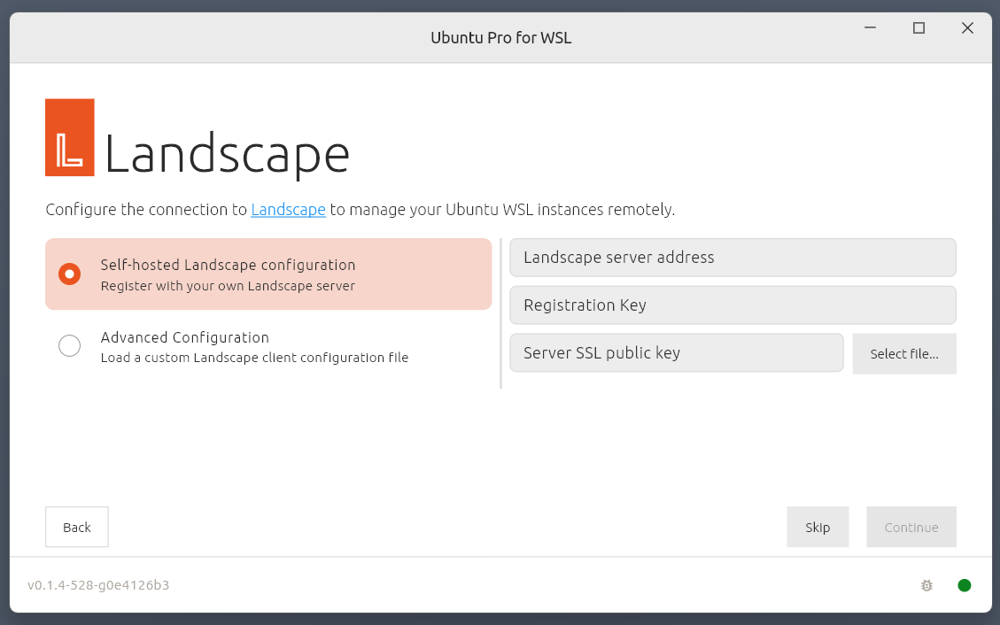

# Deployment with UP4W and Landscape

With Ubuntu Pro for WSL (UP4W) an [Ubuntu Pro](https://ubuntu.com/pro) subscription empowers you to manage Ubuntu WSL instances at scale.

In this tutorial you will develop an understanding of how UP4W can help you deploy and manage Ubuntu WSL instance using Landscape.

## What you will do

- Deploy an Ubuntu WSL instance locally
- Deploy an Ubuntu WSL instance remotely
- Test automatic configuration of WSL instances by UP4W

## What you need

- A Windows 10 or 11 machine with a minimum of 16GB RAM and 8-core processor
- The latest version of Landscape Server set up and configured on a physical or virtual machine
- WSL and Ubuntu 24.04 installed on Windows
- An UP4W installation configured with a Pro token

Before following this tutorial it is recommended that you complete the
[getting started](./getting-started.md) tutorial to familiarise yourself
with UP4W installation and configuration.

## Set things up

To complete this tutorial you will need to have a Landscape server
set up and you should be able access your Landscape dashboard in a browser.
Please refer to the [Landscape documentation](https://ubuntu.com/landscape/install)
for setup and configuration instructions.

(tut::config-landscape-up4w)=
### Configure Landscape in the UP4W app

```{tip}
Landscape configuration in the UP4W application must currently be enabled by setting
`ShowLandscapeConfig:DWORD=1` at `HKCU:/Software/Canonical/UbuntuPro` in the Windows
registry.
```

In the UP4W app, after entering your Pro token, navigate to the Landscape configuration screen:



Choose your preferred configuration option and enter the required details.

When you continue a status screen will appear confirming that configuration is complete:


As well as your Ubuntu Pro subscription being attached to UP4W on the Windows host,
this has also configured the Landscape client built into your UP4W Windows agent to know about your Landscape server.
UP4W will forward this configuration to the Landscape client on your Ubuntu WSL instances as well, 
and all systems where the Landscape client has been configured this way are automatically registered with Landscape.

> A dedicated how-to guide on configuring Landscape with UP4W can be found [here](../howto/set-up-landscape-client).

(tut::create-instance-local)=
### Create an Ubuntu WSL instance locally

Open Windows PowerShell and run the following command to create a new Ubuntu 24.04 instance,
creating a user and password when prompted. For quick testing, set both to `u`:

```text
PS C:\Users\me\tutorial> ubuntu2404.exe
```

Verify Pro-attachment with:

```text
u@mib:~$ pro status
```

UP4W should have also Landscape-registered this instance.

To verify, refresh the Landscape server web page and the instance should be listed under "Computers needing authorisation".


To accept the registration click on the instance name, set "Tags" to `wsl-vision` in the pop-up then click **Accept**.
The `wsl-vision` tag will be used for all the instances accepted into Landscape.


(tut::create-instance-remote)=
### Create an Ubuntu WSL instance remotely

Back on the Landscape page in your web browser, navigate to "Computers" and click on the Windows machine (below: `mib`). You will find "WSL Instances" on the right side of the page.
Click on the "Install new" link then set "Instance Type" to "Ubuntu" and click **Submit**. A status page will
appear showing the progress of the new instance creation.


The Landscape server will talk to the Landscape client built into your UP4W.
UP4W will then install the `Ubuntu` application and create an Ubuntu WSL instance automatically.
In PowerShell, run `ubuntu.exe` to log in to the new instance.

```text
PS C:\Users\me\tutorial> ubuntu.exe

u@mib:~$
```

You can run `pro status` to verify pro-attachment and refresh your Landscape server page to verify and accept the registration.
As before, apply the `wsl-vision` tag and click `Accept`.

(tut::deploy-packages-remote)=
### Deploy packages to all Ubuntu WSL instances

On your Landscape server page, navigate to `Organization` > `Profiles`, click on
`Package Profiles` then `Add package profile`. Fill in the form with the following values and click "Save".

| Field               | Value                                  |
| ------------------- | -------------------------------------- |
| Title               | Vision                                 |
| Description         | Computer Vision work                   |
| Access group        | Global                                 |
| Package constraints | Manually add constraints               |
|                     | Depends on `python3-opencv` `>=` `4.0` |


On the bottom of the "Vision" profile page, in the "Association" section, set the "New tags" field to `wsl-vision` and click **Change**.


In the "Summary" section in the middle of the page you will see a status message showing that two computers are `applying the profile`. Click on the `applying the profile` link and then, in the "Activities" list, click on **Apply package profile** to see the progress of the package deployment.


When this process has completed, use one of your instance shells to verify that the `python3-opencv` package has been installed.
For example, in the `Ubuntu` instance the first three packages returned are:

```text
u@mib:~$ apt list --installed | grep -m 3 opencv

libopencv-calib3d4.5d/jammy,now 4.5.4+dfsg-9ubuntu4 amd64 [installed,automatic]
libopencv-contrib4.5d/jammy,now 4.5.4+dfsg-9ubuntu4 amd64 [installed,automatic]
libopencv-core4.5d/jammy,now 4.5.4+dfsg-9ubuntu4 amd64 [installed,automatic]
```

You know how to leverage UP4W and Landscape to efficiently manage your Ubuntu WSL instances at scale.

## Next steps

In the rest of the documentation you can find [how-to guides](../howto/index)
for completing specific tasks, [reference](../reference/index) material
describing key information relating to UP4W and dedicated [documentation for
developers](../dev/index).
