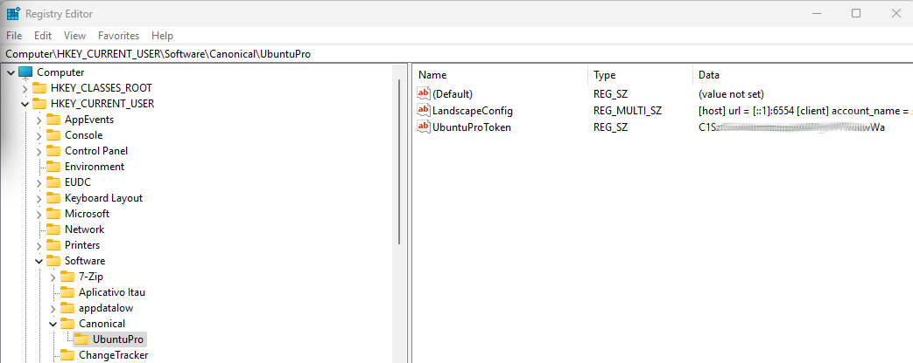

# Getting Started with Ubuntu Pro for WSL

Ubuntu Pro for WSL (UP4W) is the way to automatically manage Ubuntu WSL instances in a single Windows host or across an
organisation.

By the end of this tutorial you'll have learned how to ensure new Ubuntu WSL instances are automatically attached to
Ubuntu Pro and registered into your own self hosted Landscape server.

## Prerequisites

- A Windows 11 machine with access to the Microsoft Store and a minimum of 16GB of RAM and 8-core processor.

- Familiarity with the Windows Registry Editor and the PowerShell.

## Setup

% :tmihoc: Note or not note? That seems out of issue, but users must understand this.

```{note}
Throughout this tutorial we'll present shell commands together with their output. The commands will be prefixed by a
prompt matching the shell it's launched in. For example, `PS C:\Users\me\tutorial>` is a PowerShell prompt where the current working directory is `C:\Users\me\tutorial`, thus running on Windows.
Similarly, a Linux shell prompt logged in as root with the current working directory as the root home directory will look like `root@hostname:~#`

The outputs of the commands are preserved to give you more context.
```

### Ensure you have installed the Windows Subsystem for Linux.

[Click here to install WSL from the Microsoft Store](https://www.microsoft.com/store/productId/9P9TQF7MRM4R).

% :tmihoc: I thought we'd need some blank space here, but one full line break seems too much. WDYT?
% better than the lack of spacing. Add more throughout the tutorial!

<br />

### Ensure you have installed the Ubuntu 22.04 LTS and Ubuntu-Preview applications.

[Click here to install Ubuntu 22.04 LTS](https://www.microsoft.com/store/productId/9PN20MSR04DW)
and [here to install Ubuntu-Preview](https://www.microsoft.com/store/productId/9P7BDVKVNXZ6) from the Microsoft
Store.

```{note}
 This tutorial assumes you have a fresh installation of Ubuntu 22.04 LTS and Ubuntu-Preview. If you already have
 instances of Ubuntu 22.04 LTS and/or Ubuntu-Preview, make sure to export them, delete
 and re-import them after completing this tutorial to avoid losing any data.

 <details><summary> Expand to see how </summary>

   To export and delete the instances run:


     PS C:\Users\me\tutorial> wsl --export Ubuntu-Preview .\backup\Ubuntu-Preview.tar.gz
     Export in progress, this may take a few minutes.
     The operation completed successfully.

     PS C:\Users\me\tutorial> wsl --unregister Ubuntu-Preview
     Unregistering...
     The operation completed successfully.

   and/or

     PS C:\Users\me\tutorial> wsl --export Ubuntu-22.04 .\backup\Ubuntu-22.04.tar.gz
     Export in progress, this may take a few minutes.
     The operation completed successfully.

     PS C:\Users\me\tutorial> wsl --unregister Ubuntu-22.04
     Unregistering..
     The operation completed successfully.


  and to later import them, run:

     PS C:\Users\me\tutorial> wsl --import Ubuntu-Preview .\backup\Ubuntu-Preview .\backup\Ubuntu-Preview.tar.gz
     Import in progress, this may take a few minutes.
     The operation completed successfully.

     PS C:\Users\me\tutorial> wsl --import Ubuntu-22.04 .\backup\Ubuntu-22.04 .\backup\Ubuntu-22.04.tar.gz
     Import in progress, this may take a few minutes.
     The operation completed successfully.

 </details>
```
(ref::ensure-ubuntu-pro)=
### Ensure you have an Ubuntu Pro token

Visit the [Ubuntu Pro dashboard](https://ubuntu.com/pro) page to get the Ubuntu Pro token associated with your subscription (it's free for up to 5 machines).
Record your token as we'll use it later in this tutorial.

</details>

<br />

### Make sure to run WSL with the default settings

You can skip this step if you don't have any custom configuration inside the `~\.wslconfig` file.

Otherwise, make a backup of the file and then delete it. The default settings are the best for this tutorial.

```powershell
PS C:\Users\me\tutorial> Remove-Item ~\.wslconfig

```

### Set up a Landscape server

```{warning}
**If you already have a running Landscape server**:

We would ask that, for the purpose of this tutorial, you still set up a fresh one as shown below. That will guarantee the smoothest experience.
Also notice that this tutorial requires a specific version of Landscape, which might differ from your existing setup.
```

Open the Windows PowerShell, shutdown WSL and install the Ubuntu 22.04 LTS instance with the `--root` option.

```powershell
# Ensure a clean WSL environment.
PS C:\Users\me\tutorial> wsl --shutdown

PS C:\Users\me\tutorial> ubuntu2204.exe install --root
Installing, this may take a few minutes...
Installation successful!

```

Once complete, still in PowerShell, log in to the new instance by running `ubuntu2204.exe`. Add the
apt repository `ppa:landscape/self-hosted-beta` and install the package `landscape-server-quickstart`:

```{warning}
The installation process can take about 5 to 10 minutes. That's because the server is composed of many packages and the
performance of the installation is affected by the WSL networking, as well as the host machine power.
```

```bash
PS C:\Users\me\tutorial> ubuntu2204.exe
Welcome to Ubuntu 22.04.3 LTS (GNU/Linux 5.15.146.1-microsoft-standard-WSL2 x86_64)

 * Documentation:  https://help.ubuntu.com
 * Management:     https://landscape.canonical.com
 * Support:        https://ubuntu.com/pro

  System information as of Fri Feb 16 02:21:51 -03 2024

  System load:  0.57                Processes:             54
  Usage of /:   0.1% of 1006.85GB   Users logged in:       1
  Memory usage: 25%                 IPv4 address for eth0: 172.18.68.146
  Swap usage:   4%


This message is shown once a day. To disable it please create the
/root/.hushlogin file.

# Adding the Landscape Beta PPA:
root@mib:~# add-apt-repository ppa:landscape/self-hosted-beta -y
Repository: 'deb https://ppa.launchpadcontent.net/landscape/self-hosted-beta/ubuntu/ jammy main'
Description:
Dependencies for Landscape Server Self-Hosted Beta.
More info: https://launchpad.net/~landscape/+archive/ubuntu/self-hosted-beta
Adding repository.
Adding deb entry to /etc/apt/sources.list.d/landscape-ubuntu-self-hosted-beta-jammy.list
Adding disabled deb-src entry to /etc/apt/sources.list.d/landscape-ubuntu-self-hosted-beta-jammy.list
Adding key to /etc/apt/trusted.gpg.d/landscape-ubuntu-self-hosted-beta.gpg with fingerprint 35F77D63B5CEC106C577ED856E85A86E4652B4E6
Hit:1 http://security.ubuntu.com/ubuntu jammy-security InRelease
Hit:2 http://archive.ubuntu.com/ubuntu jammy InRelease
Hit:3 http://archive.ubuntu.com/ubuntu jammy-updates InRelease
Hit:4 http://ppa.launchpad.net/ubuntu-wsl-dev/ppa/ubuntu jammy InRelease
Hit:5 http://archive.ubuntu.com/ubuntu jammy-backports InRelease
Hit:6 http://ppa.launchpad.net/landscape/self-hosted-beta/ubuntu jammy InRelease
Hit:7 http://ppa.launchpad.net/cloud-init-dev/proposed/ubuntu jammy InRelease
Get:8 https://ppa.launchpadcontent.net/landscape/self-hosted-beta/ubuntu jammy InRelease [17.5 kB]
Get:9 https://ppa.launchpadcontent.net/landscape/self-hosted-beta/ubuntu jammy/main amd64 Packages [13.4 kB]
Get:10 https://ppa.launchpadcontent.net/landscape/self-hosted-beta/ubuntu jammy/main Translation-en [8784 B]
Fetched 39.7 kB in 2s (21.9 kB/s)
Reading package lists... Done

root@mib:~# apt update
Hit:1 http://security.ubuntu.com/ubuntu jammy-security InRelease
Hit:2 http://archive.ubuntu.com/ubuntu jammy InRelease
Hit:3 http://ppa.launchpad.net/ubuntu-wsl-dev/ppa/ubuntu jammy InRelease
Hit:4 http://archive.ubuntu.com/ubuntu jammy-updates InRelease
Hit:5 http://archive.ubuntu.com/ubuntu jammy-backports InRelease
Hit:6 http://ppa.launchpad.net/landscape/self-hosted-beta/ubuntu jammy InRelease
Hit:7 http://ppa.launchpad.net/cloud-init-dev/proposed/ubuntu jammy InRelease
Hit:8 https://ppa.launchpadcontent.net/landscape/self-hosted-beta/ubuntu jammy InRelease
Reading package lists... Done
Building dependency tree... Done
Reading state information... Done
24 packages can be upgraded. Run 'apt list --upgradable' to see them.

# Installing the Landscape Server Quickstart package:
root@mib:~# apt install landscape-server-quickstart -y
```

The installation process will eventually prompt you about Postfix configuration, `General mail configuration type`.
Select `No configuration` and hit `Tab`; then, with the `Ok` button highlighted, press `Enter`.


That should bring you back to your shell prompt and you should see the installation unfolding. If it completes successfully, the last log lines should look as below, with Landscape systemd units appearing as active.


```bash

# The last log lines of the installation process will be similar to this:
  en_ZM.UTF-8... done
  en_ZW.UTF-8... done
Generation complete.
Setting up landscape-server-quickstart (23.10+6-0landscape0) ...
Generating self-signed certificate/key pair.
If you want to use your own, place the certificate file in
/etc/ssl/certs/landscape_server.pem and the key file in /etc/ssl/private/landscape_server.key, and reconfigure this package.
.+..+.+...................................+..........+..+++++++++++++++++++++++++++++++++++++++++++++++++++++++++++++++++*...............+...+..+.+.........+...+.........+........+.+..+.......+.....+................+..+...+.......+...+......+...+..+....+++++++++++++++++++++++++++++++++++++++++++++++++++++++++++++++++*................+.....+....+.....+.+.....+......+.+...............+........+....+...+.........+....................+...+...+..................+.+......+..+...+...+.......+...+......+.....+...+.+......+.....+.............+..+.........+................+........+.+..+.......+.....+...+...+.+.....+....+.....+......+....+.....+.........+.......+.....+......+...+......+.+.....+.......+.....+......+++++++++++++++++++++++++++++++++++++++++++++++++++++++++++++++++
.....+..................+...+++++++++++++++++++++++++++++++++++++++++++++++++++++++++++++++++*.+..................+.+++++++++++++++++++++++++++++++++++++++++++++++++++++++++++++++++*.................+.+..+...............+......+....+...........+.........+.+...........+.+.....+...+....+...+..+...+.........+....+...........+...................+..............+.+......+........+......+.+......+...............+..+...+....+...+......+............+++++++++++++++++++++++++++++++++++++++++++++++++++++++++++++++++
-----
Site 000-default disabled.
2024-02-16 06:02:43.284Z INFO landscape-quickstart "Upgrading service.conf ..."
2024-02-16 06:02:43.337Z INFO landscape-quickstart "Updated message-server section."
2024-02-16 06:02:43.339Z INFO landscape-quickstart "Updated landscape section."
2024-02-16 06:02:43.346Z INFO landscape-quickstart "Checking local RabbitMQ settings."
2024-02-16 06:02:44.373Z INFO landscape-quickstart "Configuring RabbitMQ for Landscape ..."
2024-02-16 06:02:48.196Z INFO landscape-quickstart "Setting up Apache SSL configuration ..."
2024-02-16 06:02:48.248Z INFO landscape-quickstart "Configuring PostgreSQL for Landscape"
2024-02-16 06:02:48.268Z INFO landscape-quickstart "Skipping configuration migration ..."
2024-02-16 06:02:48.269Z INFO landscape-quickstart "Bootstrapping service.conf using psql ..."
2024-02-16 06:02:48.406Z INFO landscape-quickstart "Created user 'landscape'."
2024-02-16 06:02:48.478Z INFO landscape-quickstart "Created user 'landscape_superuser'."
2024-02-16 06:02:48.480Z INFO landscape-quickstart "Checking Landscape databases ..."
2024-02-16 06:02:50.343Z INFO landscape-quickstart "Checking database schema ..."
2024-02-16 06:02:58.942Z INFO landscape-quickstart "Schema configuration output:\n\nLoading site configuration...\nWARNING: PostgreSQL has max_prepared_transactions set to 0, not using two-phase commit.\nSetting up database schemas (will timeout after 86400 seconds) ...\nSchema patch version: 499\n"
2024-02-16 06:02:58.942Z INFO landscape-quickstart "Checking package database initial data ..."
2024-02-16 06:02:59.016Z INFO landscape-quickstart "Loading stock package database ..."
2024-02-16 06:09:44.485Z INFO landscape-quickstart "Stock package database loaded successfully."
2024-02-16 06:09:44.502Z INFO landscape-quickstart "Renaming stock hash-id stores ..."
2024-02-16 06:09:48.964Z INFO landscape-quickstart "Renamed 33 stock hash-id stores against uuid fd2e9fc2-cc91-11ee-afea-4d057cae229c"
Processing triggers for libc-bin (2.35-0ubuntu3.6) ...
Processing triggers for rsyslog (8.2112.0-2ubuntu2.2) ...
Processing triggers for ufw (0.36.1-4ubuntu0.1) ...
Processing triggers for man-db (2.10.2-1) ...
Processing triggers for dbus (1.12.20-2ubuntu4.1) ...

# Check that no Landscape systemd unit is failed:
root@mib:~# systemctl --state=failed --no-legend --no-pager | grep landscape # Outputs nothing
root@mib:~# systemctl --state=running --no-legend --no-pager | grep landscape
  landscape-api.service                 loaded active running LSB: Enable Landscape API
  landscape-appserver.service           loaded active running LSB: Enable Landscape frontend UI
  landscape-async-frontend.service      loaded active running LSB: Enable Landscape async frontend
  landscape-hostagent-consumer.service  loaded active running Landscape's WSL Message Consumer
  landscape-hostagent-messenger.service loaded active running Landscape's WSL Message Service
  landscape-job-handler.service         loaded active running LSB: Enable Landscape job handler
  landscape-msgserver.service           loaded active running LSB: Enable Landscape message processing
  landscape-package-search.service      loaded active running Landscape's Package Search daemon
  landscape-package-upload.service      loaded active running LSB: Enable Landscape Package Upload service
  landscape-pingserver.service          loaded active running LSB: Enable Landscape ping server
  landscape-secrets-service.service     loaded active running Landscape's Secrets Management Service
```

Once the installation completes, Landscape will be served on `localhost` port 8080.

Open your favourite browser on Windows and enter the address `http://127.0.0.1:8080`. It will show the page to create the Landscape global
admin account. Enter the following credentials and click the `Sign Up` button:

| Field             | Value           |
|-------------------|-----------------|
| Name              | Admin           |
| E-mail address    | `admin@mib.com` |
| Passphrase        | 123             |
| Verify passphrase | 123             |


Finally copy the Landscape server certificate into your Windows user profile directory. Landscape client inside the WSL
instances will need that certificate to connect to the server.

```bash
root@mib:~# cp /etc/ssl/certs/landscape_server.pem /mnt/c/users/me/
root@mib:~#
```

All set! Your self hosted Landscape instance is ready to go.
Keep the current terminal open so the server stays running until we complete this tutorial.

```{note}
**If you accidentally close the terminal**:

Open a new terminal window and run `ubuntu2204.exe`. Landscape server and related components will start automatically.
```

## Install Ubuntu Pro For WSL

To install Ubuntu Pro for WSL open the Microsoft Store from [this link](https://www.microsoft.com/store/productId/9PD1WZNBDXKZ) and click the big blue "Install" button.


Once the installation is complete, you will see a Start button. Click it. That will start the UP4W Windows agent. When the progress bar indicates that the process has been completed, close the application -- in this tutorial we will not be using the UP4W Windows Agent through the UP4W GUI but rather the Windows registry.


## Configure Ubuntu Pro for WSL

In the Windows Start Menu, locate the Registry Editor and open it.
Navigate in the left pane to `HKEY_CURRENT_USER\Software\`.
Create a new key named `Canonical` and inside it create another key named `UbuntuPro`.
Inside the `UbuntuPro` key we just created, add a string value named `UbuntuProToken` and paste your token inside that
value data field (the token you copied from the Ubuntu Pro dashboard in the [Setup](ref::ensure-ubuntu-pro) phase).
Still inside the `UbuntuPro` key, add a multi string value named `LandscapeConfig` and paste into its
data field the following contents, replacing>:

- `<HOSTNAME>` by the actual host name of your Windows machine and
- `<YOUR_WINDOWS_USER_NAME>` by the actual user name of your Windows account.

```
[host]
url = [::1]:6554
[client]
account_name = standalone
registration_key =
url = https://<HOSTNAME>/message-system
log_level = debug
ping_url = https://<HOSTNAME>/ping
ssl_public_key = C:\Users\<YOUR_WINDOWS_USER_NAME>\landscape_server.pem
```
% If really needed we can start without the SSL public key and add it after the Windows host is registered in Landscape.



```{note}
There is the alternative of supplying this configuration data via a graphical user interface application. This tutorial
focuses on the registry editor as system administrators can quickly relate to it to find means of deploying such data
at scale.
```

Ubuntu Pro for WSL is ready to go. Let's see now what it can do with that configuration information.

## Check that the Windows host is registered in to Landscape

Go back to the Windows web browser and refresh the Landscape page. At the right side of the main content area of the
page you should see a request to approve your Windows host registration ("Computers needing authorisation").
Click on the computer name (`mib` in my case), when the new page loads click on the `Accept` button.

```{note}
**If you already closed the browser tab**:

Just open a new one, navigate to `http://127.0.0.1:8080` and log in with the credentials you created earlier.
```


On the top of the page, at the right side of the Landscape logo, click on "Computers". You should see your host machine listed there. Details such as the operating system may take a few minutes to appear.


## Create a new Ubuntu-Preview instance manually

Open the Windows PowerShell and run the following command to create a new Ubuntu-Preview instance.
When prompted create the default user and password. For convenience, we'll set both to `u`.
When done you'll be logged in to the new instance shell.

```powershell
PS C:\Users\me\tutorial> ubuntupreview.exe

Installing, this may take a few minutes...
Please create a default UNIX user account. The username does not need to match your Windows username.
For more information visit: https://aka.ms/wslusers
Enter new UNIX username: u
New password:
Retype new password:
passwd: password updated successfully
Installation successful!
To run a command as administrator (user "root"), use "sudo <command>".
See "man sudo_root" for details.

u@mib:~$

```

Run the command `pro status` to confirm that the new instance was automatically attached to Ubuntu Pro.
You should see some services enabled (for now, ESM) and the account and subscription information at the bottom of the output.

```bash
u@mib:~$ pro status
SERVICE          ENTITLED  STATUS       DESCRIPTION
esm-apps         yes       enabled      Expanded Security Maintenance for Applications
esm-infra        yes       enabled      Expanded Security Maintenance for Infrastructure

NOTICES
Operation in progress: pro attach

For a list of all Ubuntu Pro services, run 'pro status --all'
Enable services with: pro enable <service>

     Account: me@ubuntu.com
Subscription: Ubuntu Pro - free personal subscription
u@mib:~$
```

Run `sudo apt update`. You should notice in the output that you’re accessing packages from all the enabled services (for now, ESM).

```bash
u@mib:~$ sudo apt update
Hit:1 http://archive.ubuntu.com/ubuntu noble InRelease
Hit:2 http://ppa.launchpad.net/ubuntu-wsl-dev/ppa/ubuntu noble InRelease
Hit:3 http://security.ubuntu.com/ubuntu noble-security InRelease
Hit:4 http://archive.ubuntu.com/ubuntu noble-updates InRelease
Hit:5 http://ppa.launchpad.net/landscape/self-hosted-beta/ubuntu noble InRelease
Hit:6 https://esm.ubuntu.com/apps/ubuntu noble-apps-security InRelease
Hit:7 http://archive.ubuntu.com/ubuntu noble-backports InRelease
Hit:8 http://ppa.launchpad.net/cloud-init-dev/proposed/ubuntu noble InRelease
Hit:9 https://esm.ubuntu.com/infra/ubuntu noble-infra-security InRelease        # Notice the ESM repositories
Reading package lists... Done
Building dependency tree... Done
Reading state information... Done
All packages are up to date.
```

Great! Your new WSL instance is granted access to extended security patches automatically!

## Check that the new Ubuntu-Preview instance is registered with Landscape

Go back to the Landscape web page and refresh it. UP4W has taken care to register your WSL instance automatically! You should see it listed under the "Computers needing authorisation" section.


Click on the instance name. At the bottom of the page that just loaded, in the "Tags" field, add the value `wsl-vision` and then click on
the `Accept` button to accept this instance into your account.


Your new WSL instance was registered into Landscape automatically!

## Create a new WSL instance via Landscape

Back to your Windows browser, at the Landscape page, navigate to "Computers" and click on the Windows machine (`mib` in
my case). You'll find the "WSL Instances" at the right side of the page and a "Install new" link close to it.
Click on that link. Once the page loads, select "Instance Type" "Ubuntu" and click on "Submit". A status page will
appear showing the progress of the new instance creation.


In PowerShell, run `ubuntu.exe` to log in to the new instance.

```powershell
PS C:\Users\me\tutorial> ubuntu.exe
To run a command as administrator (user "root"), use "sudo <command>".
See "man sudo_root" for details.

Welcome to Ubuntu 22.04.3 LTS (GNU/Linux 5.15.146.1-microsoft-standard-WSL2 x86_64)

 * Documentation:  https://help.ubuntu.com
 * Management:     https://landscape.canonical.com
 * Support:        https://ubuntu.com/advantage


This message is shown once a day. To disable it please create the
/home/me/.hushlogin file.
me@mib:~$
```

After a few minutes, the new instance will show up as pending approval, similar to what seen before.
Apply the same `wsl-vision` tag and `Accept` it as we did with `Ubuntu-Preview`.

```{note}
Upon Landscape request, UP4W just installed the `Ubuntu` application from the Microsoft Store and then created the WSL instance for you.
```

## Deploy packages to those instances

Back to the Windows browser, at the Landscape page, navigate to `Organization` > `Profiles` and click on
`Package Profiles`, then `Add package profile`. Fill in the form with the following values and click "Save".

| Field               | Value                                  |
| ---                 | ---                                    |
| Title               | Vision                                 |
| Description         | Computer Vision work                   |
| Access group        | Global                                 |
| Package constraints | Manually add constraints               |
|                     | Depends on `python3-opencv` `>=` `4.0` |


At the bottom of the "Vision" profile page, in the "Association" section, fill in the "New tags" field with the value
`wsl-vision` we used to tag the instances when they were accepted in Landscape and click "Change".


In the "Summary" section in the middle of the page a status message will show that 2 computers are `applying the profile`. Click on the `applying the profile` link and then, in the "Activities" list, click on "Apply package profile" to see the progress of the package deployment.


Eventually the instances will report having succeeded in applying the profile. Verify in the instances shells that the `python3-opencv` package was installed.
For example, in the `Ubuntu` instance it would look like:

```bash
me@mib:~$ apt list --installed | grep opencv

WARNING: apt does not have a stable CLI interface. Use with caution in scripts.

libopencv-calib3d4.5d/jammy,now 4.5.4+dfsg-9ubuntu4 amd64 [installed,automatic]
libopencv-contrib4.5d/jammy,now 4.5.4+dfsg-9ubuntu4 amd64 [installed,automatic]
libopencv-core4.5d/jammy,now 4.5.4+dfsg-9ubuntu4 amd64 [installed,automatic]
libopencv-dnn4.5d/jammy,now 4.5.4+dfsg-9ubuntu4 amd64 [installed,automatic]
libopencv-features2d4.5d/jammy,now 4.5.4+dfsg-9ubuntu4 amd64 [installed,automatic]
libopencv-flann4.5d/jammy,now 4.5.4+dfsg-9ubuntu4 amd64 [installed,automatic]
libopencv-highgui4.5d/jammy,now 4.5.4+dfsg-9ubuntu4 amd64 [installed,automatic]
libopencv-imgcodecs4.5d/jammy,now 4.5.4+dfsg-9ubuntu4 amd64 [installed,automatic]
libopencv-imgproc4.5d/jammy,now 4.5.4+dfsg-9ubuntu4 amd64 [installed,automatic]
libopencv-ml4.5d/jammy,now 4.5.4+dfsg-9ubuntu4 amd64 [installed,automatic]
libopencv-objdetect4.5d/jammy,now 4.5.4+dfsg-9ubuntu4 amd64 [installed,automatic]
libopencv-photo4.5d/jammy,now 4.5.4+dfsg-9ubuntu4 amd64 [installed,automatic]
libopencv-shape4.5d/jammy,now 4.5.4+dfsg-9ubuntu4 amd64 [installed,automatic]
libopencv-stitching4.5d/jammy,now 4.5.4+dfsg-9ubuntu4 amd64 [installed,automatic]
libopencv-video4.5d/jammy,now 4.5.4+dfsg-9ubuntu4 amd64 [installed,automatic]
libopencv-videoio4.5d/jammy,now 4.5.4+dfsg-9ubuntu4 amd64 [installed,automatic]
libopencv-viz4.5d/jammy,now 4.5.4+dfsg-9ubuntu4 amd64 [installed,automatic]
python3-opencv/jammy,now 4.5.4+dfsg-9ubuntu4 amd64 [installed,automatic]
```

Good job! Your instances are transparently managed by Landscape thanks to the automation provided by Ubuntu Pro for WSL.

## Conclusion

In this tutorial you learned how to ensure new Ubuntu WSL instances are automatically attached to Ubuntu Pro and
registered into a self hosted Landscape server thanks to the automation provided by Ubuntu Pro for WSL.
Here is a complete overview of what we just achieved:

[Diagram]

