# Get started with UP4W

Windows Subsystem for Linux ([WSL](https://ubuntu.com/desktop/wsl)) makes it possible to run Ubuntu — the number 1 open-source operating system — on a Windows machine.
With Ubuntu Pro for WSL (UP4W) an [Ubuntu Pro](https://ubuntu.com/pro) subscription empowers you to manage Ubuntu WSL instances at scale.

In this tutorial you will develop an understanding of how UP4W can be installed and deployed for managing multiple WSL instances.
To complete this tutorial you will need a machine running Windows 10 or 11 with a minimum of 16GB RAM and a 8-core processor.

```{note}
WSL enables using a Linux shell and Windows PowerShell side-by-side on the same machine.
Throughout this tutorial, commands will be prefixed by a prompt that indicates the shell being used, for example:

- `PS C:\Users\me\tutorial>` is a PowerShell prompt where the current working directory is `C:\Users\me\tutorial`.

- `ubuntu@wsl:~/tutorial$` indicates a Linux shell prompt login as ubuntu where the current working directory is `/home/ubuntu/tutorial/`

Output logs are included in this tutorial when instructive but are typically omitted to save space.
```

## Set things up

### Install WSL and Ubuntu

WSL can be installed directly from the [Microsoft Store](https://www.microsoft.com/store/productId/9P9TQF7MRM4R).

If you already have WSL installed you are advised to backup `~\.wslconfig` and remove it before continuing the tutorial:

```text
PS C:\Users\me\tutorial> Remove-Item ~\.wslconfig
```

Ubuntu can also be installed from the Microsoft Store.
Choose [Ubuntu 22.04 LTS](https://www.microsoft.com/store/productId/9PN20MSR04DW) or [Ubuntu (Preview)](https://www.microsoft.com/store/productId/9P7BDVKVNXZ6)
for this tutorial.

(ref::backup-warning)=
```{warning}
**If you already have Ubuntu WSL pre-installed:** 

We recommend that they are exported then deleted.
You can then install them as described in this tutorial.
At the end of the tutorial you can re-import and restore your data.

 <details><summary> How do I export, delete, and re-import Ubuntu 22.04 LTS? </summary>

     PS C:\Users\me\tutorial> wsl --export Ubuntu-22.04 .\backup\Ubuntu-22.04.tar.gz
     Export in progress, this may take a few minutes.
     The operation completed successfully.

     PS C:\Users\me\tutorial> wsl --unregister Ubuntu-22.04
     Unregistering..
     The operation completed successfully.

     PS C:\Users\me\tutorial> wsl --import Ubuntu-22.04 .\backup\Ubuntu-22.04 .\backup\Ubuntu-22.04.tar.gz
     Import in progress, this may take a few minutes.
     The operation completed successfully.

 </details>

<details><summary> How do I export, delete, and re-import Ubuntu (Preview)? </summary>
   
     PS C:\Users\me\tutorial> wsl --export Ubuntu-Preview .\backup\Ubuntu-Preview.tar.gz
     Export in progress, this may take a few minutes.
     The operation completed successfully.

     PS C:\Users\me\tutorial> wsl --unregister Ubuntu-Preview
     Unregistering...
     The operation completed successfully.
	 
     PS C:\Users\me\tutorial> wsl --import Ubuntu-Preview .\backup\Ubuntu-Preview .\backup\Ubuntu-Preview.tar.gz
     Import in progress, this may take a few minutes.
     The operation completed successfully.	 

 </details>
```

You can now launch WSL instances of Ubuntu on your Windows machine.

### Set up Landscape

While a Landscape server typically runs on external computers for this tutorial it will be set up on a WSL instance on your Windows machine.

In PowerShell, `shutdown` WSL then install the Ubuntu 22.04 LTS instance with the `--root` option.

```text
PS C:\Users\me\tutorial> wsl --shutdown

PS C:\Users\me\tutorial> ubuntu2204.exe install --root
```

After successful installation log in to the new instance and add the landscape apt repository:


```text
PS C:\Users\me\tutorial> ubuntu2204.exe

root@mib:~$ add-apt-repository ppa:landscape/self-hosted-beta -y

```

Update packages and then install the `landscape-server-quickstart` package.

```text
root@mib:~$ apt update

root@mib:~$ apt install landscape-server-quickstart -y
```

A dialog will appear for 'Postfix configuration'.
For 'General mail configuration type' select **No configuration**.
Hit **Tab** to highlight the **Ok** button, press **Enter** and
you will be returned to the shell prompt.


If Landscape has installed successfully, the log will indicate that Landscape systemd units are active.
An example log is shown below for the first three units:

```text
root@mib:~$ systemctl --state=running --no-legend --no-pager | grep -m 3 landscape
  landscape-api.service                 loaded active running LSB: Enable Landscape API
  landscape-appserver.service           loaded active running LSB: Enable Landscape frontend UI
  landscape-async-frontend.service      loaded active running LSB: Enable Landscape async frontend
```

Once installed Landscape will be served on `localhost` port 8080. Open your favourite browser on Windows and navigated to `http://127.0.0.1:8080` to create the Landscape global admin account.
Enter the following credentials and click the **Sign Up** button:

| Field             | Value           |
| ----------------- | --------------- |
| Name              | Admin           |
| E-mail address    | `admin@mib.com` |
| Passphrase        | 123             |
| Verify passphrase | 123             |


The Landscape client inside of any WSL instance will need the Landscape server certificate to connect to the server.

To achieve this copy the Landscape server certificate into your Windows user profile directory:

```text
root@mib:~$ cp /etc/ssl/certs/landscape_server.pem /mnt/c/users/me/
```

Done -- your self-hosted Landscape server is now up and running! 
Now if you configure the Landscape client on your Ubuntu WSL instances to detect this server, they will also be registered with the Landscape service included in your Ubuntu Pro subscription.

The server will stay running until you close the terminal, so keep the terminal open for the rest of the tutorial.
If you do close the terminal running `ubuntu2204.exe` in a new terminal window will start the Landscape server automatically.

(tut::ensure-ubuntu-pro)=
### Get an Ubuntu Pro token

An Ubuntu Pro subscription gives you a token that can be added to the Ubuntu Pro client on WSL instances.

Visit the [Ubuntu Pro](https://ubuntu.com/pro/subscribe) page to get a subscription.
The `Myself` option for a personal subscription is free for up to 5 machines. 

Your subscription token can then be retrieved from the [Ubuntu Pro Dashboard](https://ubuntu.com/pro/dashboard).

With your token you can now install UP4W.

### Install UP4W

% :TODO: remove this warning once the app is made generally available (after the beta period).

```{warning}
The install link below will work only if you're logged in to the Microsoft Store with an account for which access to the app has been enabled.
```

To install UP4W go to [this link to the Microsoft Store](https://www.microsoft.com/store/productId/9PD1WZNBDXKZ) and click **Install**.

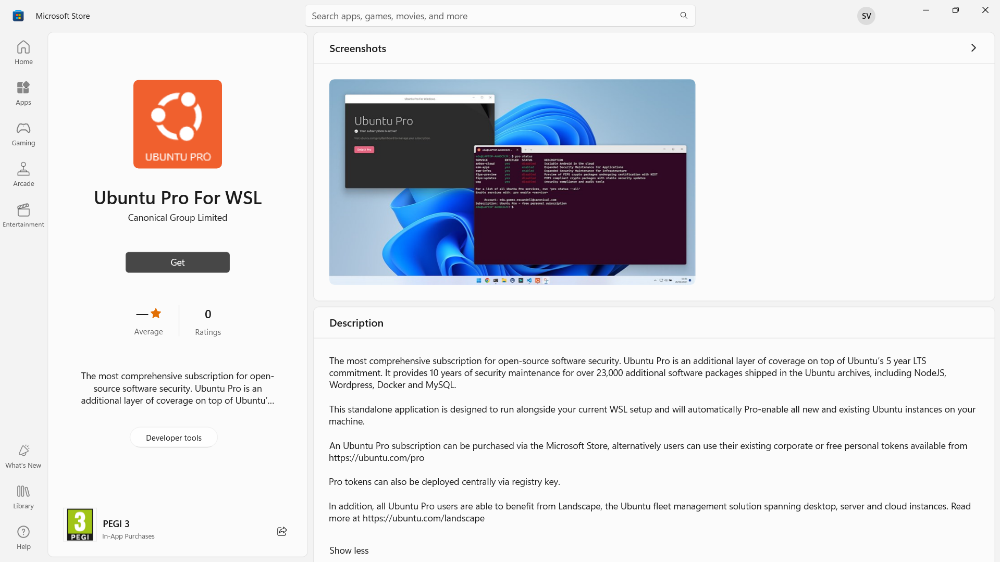

After installation has finished click **Start** to begin configuring UP4W.

% :NOTE: Instead of the GUI, it's possible to configure UP4W through the Windows registry, which enables you to do things at scale. This should be explained here or elsewhere.

In the UP4W Windows application click the arrow beside "Already have a token?".

Paste your token from the Ubuntu Pro dashboard during [Setup](tut::ensure-ubuntu-pro) and click "Confirm".
You will then be shown the Landscape configuration screen.

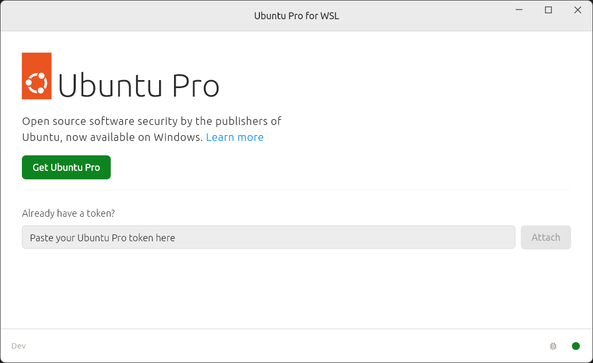

Create a new file in your home directory named `landscape.txt` and enter following contents, replacing:

- `<HOSTNAME>` by the actual host name of your Windows machine and
- `<YOUR_WINDOWS_USER_NAME>` by the actual user name of your Windows account

```text
[host]
url = [::1]:6554
[client]
account_name = standalone
registration_key =
url = https://<HOSTNAME>/message-system
log_level = debug
ping_url = https://<HOSTNAME>/ping
ssl_public_key = C:\Users\<YOUR_WINDOWS_USER_NAME>\landscape_server.pem
```
% If really needed we can start without the SSL public key and add it after the Windows host is registered in Landscape.

Then load that file using the "Custom Configuration" part of the screen, as shown below:

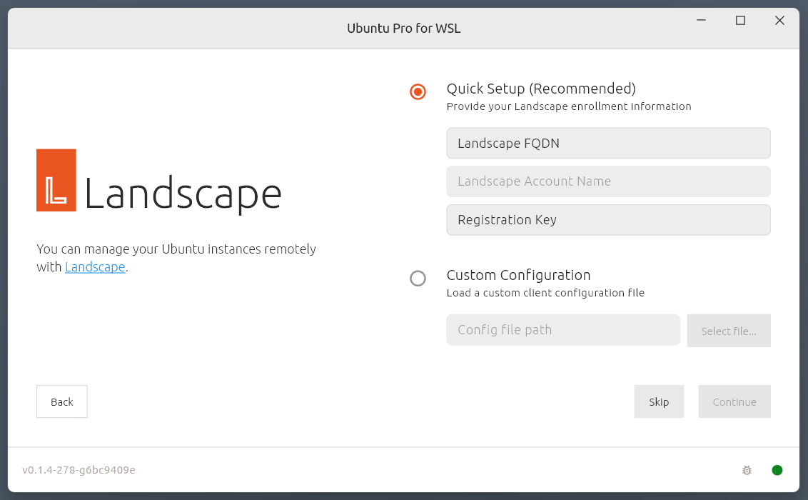

Click on the "Continue" button and you will see a status screen confirming the configuration is complete.

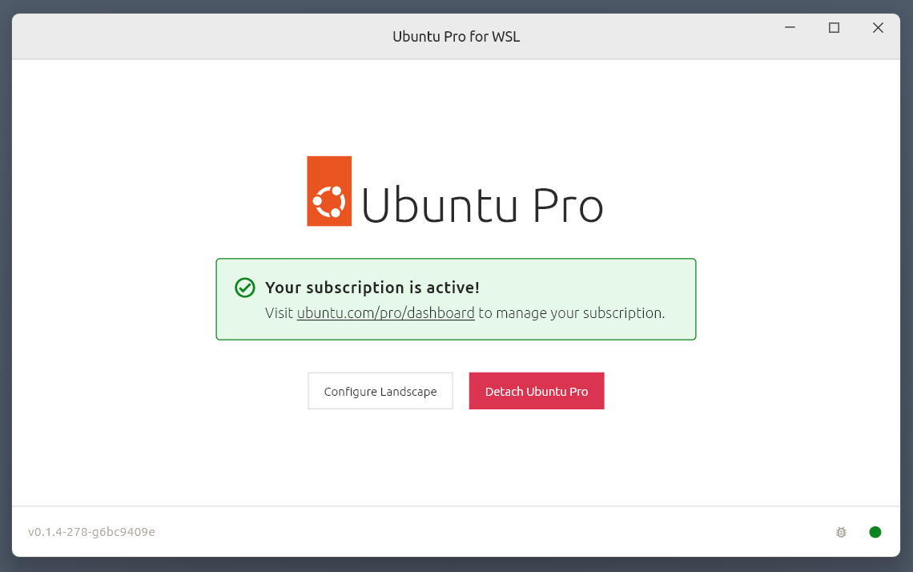

Done! You can now close the UP4W window.

Your Ubuntu Pro subscription is now attached to UP4W on the Windows host.
UP4W will automatically forward the subscription to the Ubuntu Pro client on your Ubuntu WSL instances.
This means that all Ubuntu WSL instances will be automatically added to your Ubuntu Pro subscription.

This has also configured the Landscape client built into your UP4W Windows agent to know about your Landscape server; UP4W will forward this configuration to the Landscape client on your Ubuntu WSL instances as well; and all systems where the Landscape client has been configured this way are automatically registered with Landscape.

### UP4W host registration with Landscape

Go back to your web browser and refresh the Landscape page at `http://127.0.0.1:8080`. On the right-hand side of the
page you should see a request to approve your Windows host registration ("Computers needing authorisation").
Click on the computer name (in this case: `mib`) and when the new page loads click **Accept**.


At the top of the page, on the right-hand side of the Landscape logo, click on "Computers". You should see your host machine listed. Details such as the operating system may take some time to appear.

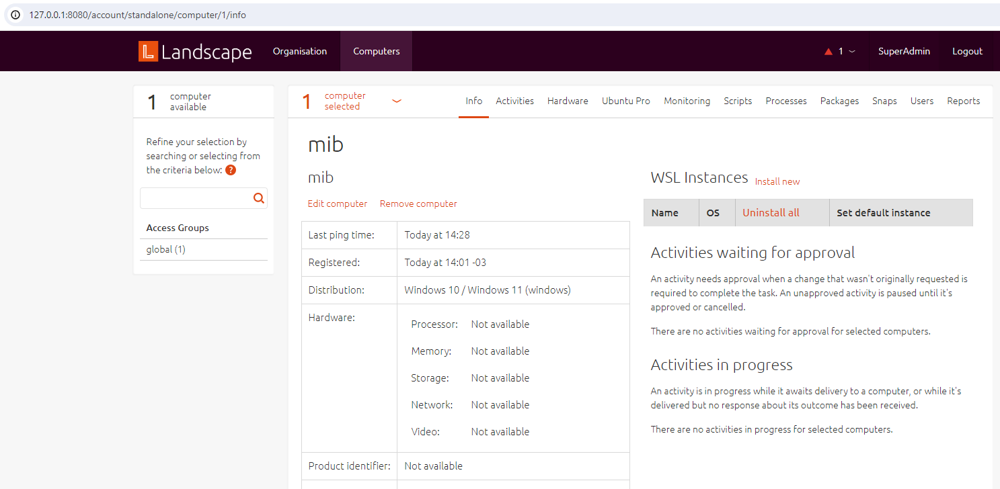

Now you can leverage UP4W from your Landscape server to create and provision Ubuntu WSL instances on the host.

## Deploy WSL instances

### Create an Ubuntu WSL instance locally

Open Windows PowerShell and run the following command to create a new Ubuntu-Preview instance.
When prompted create the default user and password. For convenience, we'll set both to `u`.

```text
PS C:\Users\me\tutorial> ubuntupreview.exe

Installing, this may take a few minutes...
Please create a default UNIX user account. The username does not need to match your Windows username.
For more information visit: https://aka.ms/wslusers
Enter new UNIX username: u
New password:
Retype new password:
passwd: password updated successfully
Installation successful!
To run a command as administrator (user "root"), use "sudo <command>".
See "man sudo_root" for details.

u@mib:~$

```

You will now be logged in to the new instance shell and can
check that UP4W has Pro-attached this instance:

The output indicates that services like ESM are enabled, with account and subscription information also shown:

```text
u@mib:~$ pro status
SERVICE          ENTITLED  STATUS       DESCRIPTION
esm-apps         yes       enabled      Expanded Security Maintenance for Applications
esm-infra        yes       enabled      Expanded Security Maintenance for Infrastructure

NOTICES
Operation in progress: pro attach

For a list of all Ubuntu Pro services, run 'pro status --all'
Enable services with: pro enable <service>

     Account: me@ubuntu.com
Subscription: Ubuntu Pro - free personal subscription
u@mib:~$
```

Packages can be accessed from all the enabled services:

```text
u@mib:~$ sudo apt update
Hit:1 http://archive.ubuntu.com/ubuntu noble InRelease
Hit:2 http://ppa.launchpad.net/ubuntu-wsl-dev/ppa/ubuntu noble InRelease
Hit:3 http://security.ubuntu.com/ubuntu noble-security InRelease
Hit:4 http://archive.ubuntu.com/ubuntu noble-updates InRelease
Hit:5 http://ppa.launchpad.net/landscape/self-hosted-beta/ubuntu noble InRelease
Hit:6 https://esm.ubuntu.com/apps/ubuntu noble-apps-security InRelease
Hit:7 http://archive.ubuntu.com/ubuntu noble-backports InRelease
Hit:8 http://ppa.launchpad.net/cloud-init-dev/proposed/ubuntu noble InRelease
Hit:9 https://esm.ubuntu.com/infra/ubuntu noble-infra-security InRelease
Reading package lists... Done
Building dependency tree... Done
Reading state information... Done
All packages are up to date.
```

UP4W should have also Landscape-registered this instance.
To verify, refresh the Landscape server web page and the instance should be listed under "Computers needing authorisation".

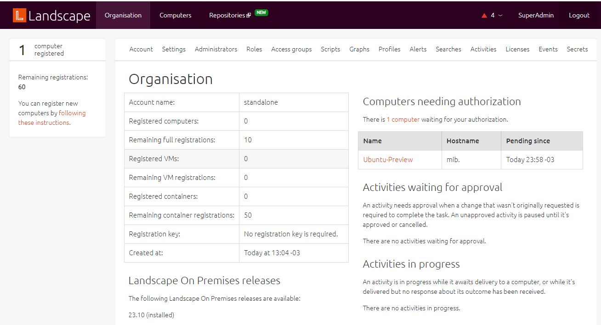

To accept the registration click on the instance name, set "Tags" to `wsl-vision` in the pop-up then click **Accept**.
The `wsl-vision` tag will be used for all the instances accepted into Landscape.

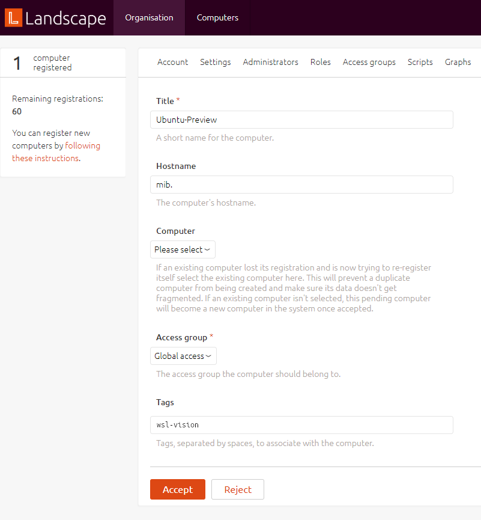

### Create an Ubuntu WSL instance remotely

Back on the Landscape page in your web browser, navigate to "Computers" and click on the Windows machine (below: `mib`). You will find "WSL Instances" on the right side of the page.
Click on the "Install new" link then set "Instance Type" to "Ubuntu" and click "Submit". A status page will
appear showing the progress of the new instance creation.

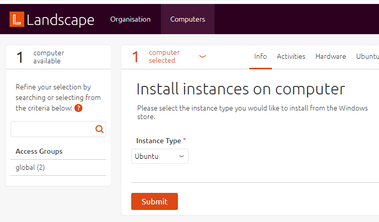

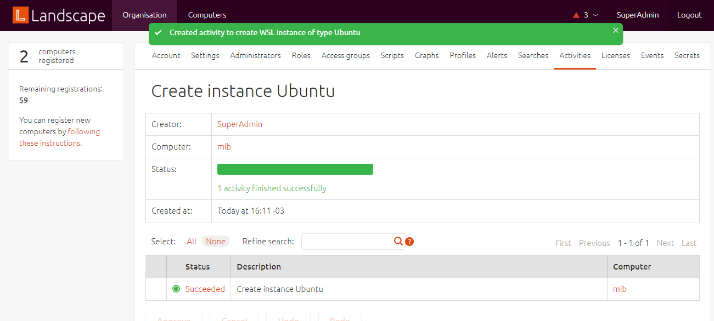

The Landscape server will talk to the Landscape client built into your UP4W.
UP4W will then install the `Ubuntu` application and create an Ubuntu WSL instance automatically.
In PowerShell, run `ubuntu.exe` to log in to the new instance.

```text
PS C:\Users\me\tutorial> ubuntu.exe

me@mib:~$
```

You can run `pro status` to verify pro-attachment and refresh your Landscape server page to verify and accept the registration.
As before, apply the `wsl-vision` tag and click `Accept`.

### Deploy packages to all Ubuntu WSL instances

On your Landscape server page, navigate to `Organization` > `Profiles`, click on
`Package Profiles` then `Add package profile`. Fill in the form with the following values and click "Save".

| Field               | Value                                  |
| ------------------- | -------------------------------------- |
| Title               | Vision                                 |
| Description         | Computer Vision work                   |
| Access group        | Global                                 |
| Package constraints | Manually add constraints               |
|                     | Depends on `python3-opencv` `>=` `4.0` |


On the bottom of the "Vision" profile page, in the "Association" section, set the "New tags" field to `wsl-vision` and click **Change**.

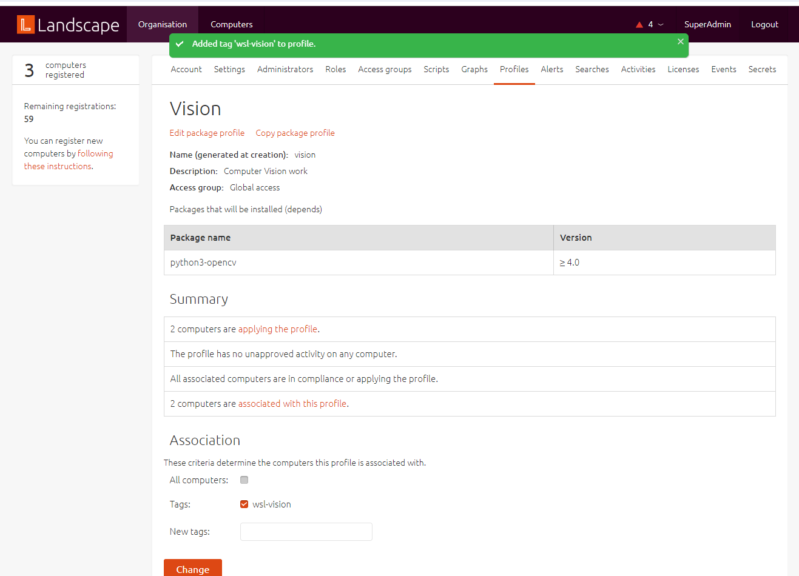

In the "Summary" section in the middle of the page you will see a status message showing that two computers are `applying the profile`. Click on the `applying the profile` link and then, in the "Activities" list, click on **Apply package profile** to see the progress of the package deployment.

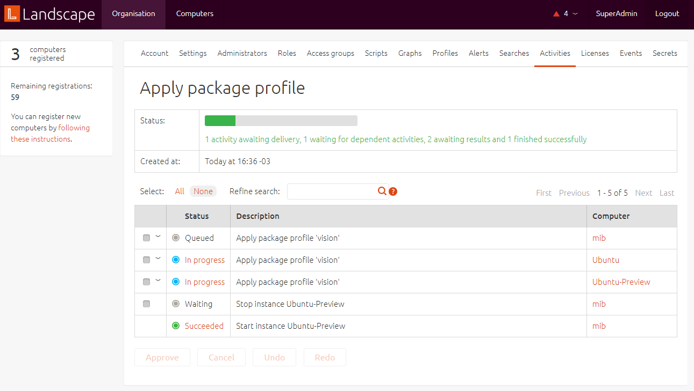

When this process has completed, use one of your instance shells to verify that the `python3-opencv` package has been installed.
For example, in the `Ubuntu` instance the first three packages returned are:

```text
me@mib:~$ apt list --installed | grep -m 3 opencv

libopencv-calib3d4.5d/jammy,now 4.5.4+dfsg-9ubuntu4 amd64 [installed,automatic]
libopencv-contrib4.5d/jammy,now 4.5.4+dfsg-9ubuntu4 amd64 [installed,automatic]
libopencv-core4.5d/jammy,now 4.5.4+dfsg-9ubuntu4 amd64 [installed,automatic]
```

You know how to leverage UP4W and Landscape to efficiently manage your Ubuntu WSL instances at scale.
Below you can see the architecture of what you have built -- congratulations!

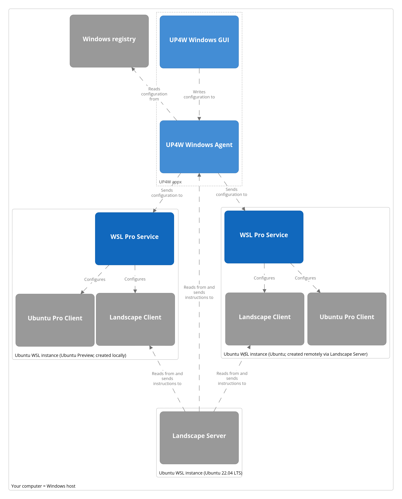

## Tear things down

### Uninstall UP4W

In the Windows Start Menu, locate the "Ubuntu Pro for WSL" application and right-click on it, then select "Uninstall".

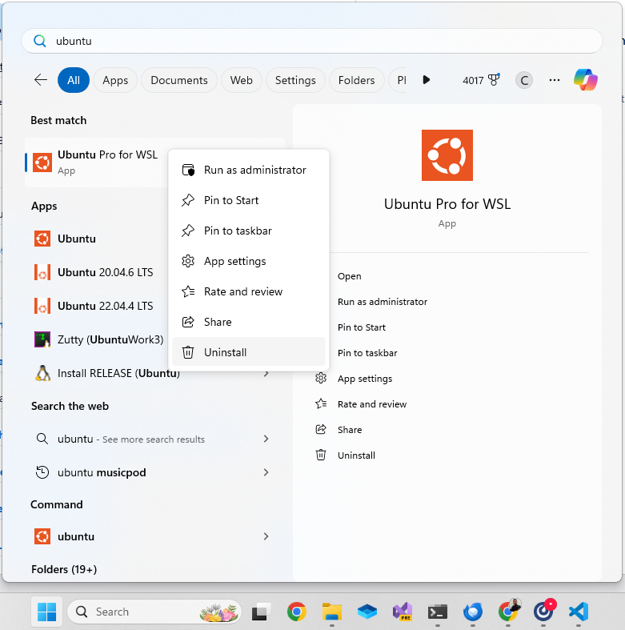

Additionally remove the `.ubuntupro` directory from your Windows user profile directory.

```text
PS C:\Users\me\tutorial> Remove-Item -Recurse -Force C:\Users\me\.ubuntupro
```

### Remove Ubuntu WSL apps

```{warning}
**If you already have them pre-installed:**

Refer to the [backup instructions](ref::backup-warning) to restore your pre-existing instances.

Otherwise, proceed with the commands below.
```

In PowerShell run the following command to stop WSL:

```text
PS C:\Users\me\tutorial> wsl --shutdown
```

Then, in the Windows Start Menu, locate the "Ubuntu 22.04 LTS" application, right-click on it, and select "Uninstall",
as done with UP4W. Do the same for the "Ubuntu (Preview)" and "Ubuntu" applications.

The instances will be removed automatically.

### Remove WSL app

Only do this if you don't need WSL on this Windows machine following the tutorial.

In the Windows Start Menu locate the "WSL" application, right-click on it then select "Uninstall".

## Next steps

This tutorial has introduced you to the amazing things that can be achieved with with UP4W. But there is more to explore:

| IF YOU ARE WONDERING…          | VISIT…              |
| ------------------------------ | ------------------- |
| “How do I…?”                   | UP4W How-to docs    |
| “What is…?”                    | UP4W Reference docs |
| “How do I contribute to UP4W?” | Developer docs      |

%| “Why…?”, “So what?”	UP4W Explanation docs 

