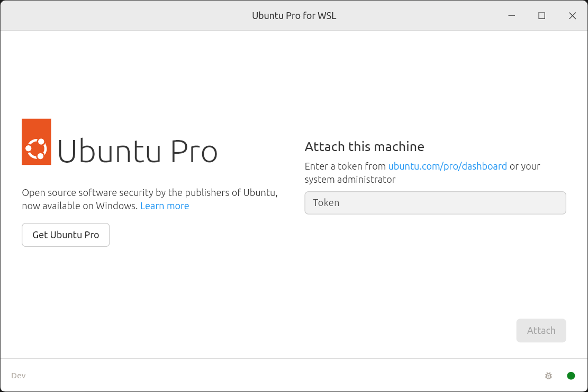

---
myst:
  html_meta:
    "description lang=en":
      "Ubuntu Pro for WSL is a Windows application that automatically attaches your Ubuntu Pro subscription to every Ubuntu instance created on WSL."
---

(howto::up4w)=
# Get started with Ubuntu Pro for WSL

```{include} ../pro_content_notice.txt
    :start-after: <!-- Include start pro -->
    :end-before: <!-- Include end pro -->
```

Windows Subsystem for Linux ([WSL](https://ubuntu.com/desktop/wsl)) is an easy and fast way to run Ubuntu on a Windows machine.
Ubuntu Pro for WSL (UP4W) automatically attaches Ubuntu WSL instances to your [Ubuntu Pro](https://ubuntu.com/pro) subscription.
Developers get to use Ubuntu WSL while benefiting from the stability, security and compliance offered by Ubuntu Pro.

In this tutorial you will learn how to install UP4W on Windows and verify that Ubuntu WSL instances are Pro-attaching.
You should then be ready for more advanced usage scenarios.

## What you will do

- Install UP4W from the Microsoft Store
- Configure UP4W with a Pro token
- Test automatic Pro-attachment of WSL instances

(ref::backup-warning)=
```{dropdown} If you already have instances of Ubuntu on WSL installed
:open:
:color: warning
:icon: alert

We recommend that any installed instance of Ubuntu on WSL is exported then deleted.
You can then install it as described in this tutorial.
At the end of the tutorial you can import and restore your data.

Read our [how-to guide on backup and restore](../howto/backup-and-restore.md).
```

## What you will need

* Windows 11 (recommended) or Windows 10 with minimum version 21H2 on a physical machine

## Set up Ubuntu on WSL

:::{dropdown} Use of prompt symbols
:open:
:color: primary
:icon: terminal

Prompt symbols in this tutorial are used to distinguish between commands that
you run in PowerShell and commands that you run in Ubuntu:

* `>`: PowerShell
* `$`: Ubuntu

You can paste commands directly from the tutorial because the prompts are not copied.
:::

(tut::get-wsl)=
### Install WSL

To install and enable WSL on Windows, run the following command in PowerShell:

```{code-block} text
> wsl --install
```

You may need to reboot the Windows machine after WSL installation.


:::{dropdown} (Optional) Variation in WSL installation behaviour
:color: info
:icon: info

The effect of `wsl --install` depends on whether Virtual Machine Platform is
enabled on Windows:

Not enabled:

* Installs WSL components and enables WSL
* Turns on the Virtual Machine Platform
* Prompts for a reboot to complete the setup
* Does not attempt to install an Ubuntu distribution

Enabled:

* Installs WSL components and enables WSL
* Does not prompt for a reboot
* Attempts to install the default Ubuntu distribution

---

If WSL is already installed and enabled, the `wsl --install` command will
download and install the latest Ubuntu distro, unless a distro with the name
"Ubuntu" is already installed.

:::

Global configuration settings for WSL may block the communication between the Ubuntu
Pro for WSL application and instances of Ubuntu on WSL. If you already have WSL
installed, with `~\.wslconfig` on your system, we recommend that you back up the
file, then remove it, before continuing the tutorial.
For more information about `.wslconfig`, refer to the [WSL documentation from Microsoft](https://learn.microsoft.com/en-us/windows/wsl/wsl-config#wslconfig).

To check if the file exists run the following in PowerShell:

```{code-block} text
> Test-Path -Path "~\.wslconfig"
```

If this returns `True` then the file exists and can be removed with:

```{code-block} text
> Remove-Item ~\.wslconfig
```

(tut::get-ubuntu)=
### Install Ubuntu

Ubuntu 24.04 LTS is recommended for this tutorial and can be installed 
with the following command in PowerShell:

```{code-block} text
> wsl --install Ubuntu-24.04
```

For other installation options refer to our [install Ubuntu on WSL guide](https://canonical-ubuntu-wsl.readthedocs-hosted.com/en/latest/guides/install-ubuntu-wsl2/).

To confirm the installation, and that the installed distro is using WSL 2, run:

```{code-block} text
> wsl -l -v
```

```{dropdown} You must use WSL 2
:open:
:color: warning
:icon: alert

WSL 2 is the default architecture on recent versions of Windows and
is required for Ubuntu Pro for WSL to function.
Read more about the [differences between WSL versions](explanation::wsl-version).
```

To manually associate this Ubuntu instance with a Pro subscription, you could
launch the instance and run the `pro attach` command.

This, however, would need to be repeated manually for each new instance.
UP4W solves this scalability problem by automating Pro-attachment.
Next, let's take a look at how that works in practice.

## Set up Ubuntu Pro for WSL

(tut::get-ubuntu-pro)=
### Get an Ubuntu Pro token

An active Ubuntu Pro subscription provides you with a token that can be added to the Ubuntu Pro client on WSL instances.

Your subscription token can be retrieved from the [Ubuntu Pro Dashboard](https://ubuntu.com/pro/dashboard).

Visit the [Ubuntu Pro](https://ubuntu.com/pro/subscribe) page if you need a new subscription.
The `Myself` option for a personal subscription is free for up to 5 machines. 

Once you have a token you are ready to install UP4W.

(tut::get-up4w)=
### Install and configure UP4W

% :TODO: remove this warning once the app is made generally available (after the beta period).

```{dropdown} Ubuntu Pro for WSL is in beta
:open:
:color: warning
:icon: alert

The install link below will work only if you're logged in to the Microsoft Store with an account for which access to the app has been enabled.
```

UP4W can be installed from [this link to the Microsoft Store](https://apps.microsoft.com/detail/9PD1WZNBDXKZ).

Open the application and paste the token you copied from the Ubuntu Pro dashboard:



After you confirm, a status screen will appear showing that configuration is complete:


Done! You can close the UP4W window before continuing.
If at any time you want to detach your Pro subscription just open the UP4W application
and select **Detach Ubuntu Pro**.

Your Ubuntu Pro subscription is now attached to UP4W on the Windows host.
UP4W will automatically forward the subscription to the Ubuntu Pro client on your Ubuntu WSL instances.

(tut::verify-pro-attach)=
## Verify Pro-attachment

All Ubuntu WSL instances will now be automatically added to your Ubuntu Pro subscription.

In PowerShell, run the following command to launch the Ubuntu-24.04 instance
you installed previously, entering a username and password when prompted.

```{code-block} text
> wsl ~ -d Ubuntu-24.04
```

You will now be logged in to the Ubuntu instance and can check that UP4W has Pro-attached this instance with:

```{code-block} text
$ pro status
```

The output should indicate that services like ESM are enabled, with account and subscription information also shown:

```{code-block} text
:class: no-copy
SERVICE          ENTITLED  STATUS       DESCRIPTION
esm-apps         yes       enabled      Expanded Security Maintenance for Applications
esm-infra        yes       enabled      Expanded Security Maintenance for Infrastructure

NOTICES
Operation in progress: pro attach

For a list of all Ubuntu Pro services, run 'pro status --all'
Enable services with: pro enable <service>

     Account: username@ubuntu.com
Subscription: Ubuntu Pro - free personal subscription
```

Packages can also be accessed from all the enabled services.
Running `sudo apt update` will produce output like the following:

```{code-block} text
:class: no-copy
Hit:1 http://archive.ubuntu.com/ubuntu noble InRelease
Hit:2 http://ppa.launchpad.net/ubuntu-wsl-dev/ppa/ubuntu noble InRelease
Hit:3 http://security.ubuntu.com/ubuntu noble-security InRelease
Hit:4 http://archive.ubuntu.com/ubuntu noble-updates InRelease
Hit:5 http://ppa.launchpad.net/landscape/self-hosted-beta/ubuntu noble InRelease
Hit:6 https://esm.ubuntu.com/apps/ubuntu noble-apps-security InRelease
Hit:7 http://archive.ubuntu.com/ubuntu noble-backports InRelease
Hit:8 http://ppa.launchpad.net/cloud-init-dev/proposed/ubuntu noble InRelease
Hit:9 https://esm.ubuntu.com/infra/ubuntu noble-infra-security InRelease
Reading package lists... Done
Building dependency tree... Done
Reading state information... Done
All packages are up to date.
```

Now let's check that a different version of Ubuntu will also Pro-attach automatically.

Install an older LTS release --- Ubuntu 22.04 --- from PowerShell:

```{code-block} text
> wsl --install Ubuntu-22.04
```

After this instanced has installed and launched, enter a username and password, then run `pro status`.

You should again get confirmation of successful Pro-attachment for the new instance.

> If you want to uninstall UP4W after this tutorial refer to [our how-to guide](../howto/uninstalling.md).

## Next steps

This is only the start of what you can do with UP4W.

If you need to create and manage large numbers of Ubuntu WSL instances
you will probably want to use the Windows registry.
By using the Windows registry you can associate a Pro token with
each new WSL instance using your organisation's own deployment solution.

> For detailed step-by-step instructions on using the Windows registry read our short guide on how to [install and configure UP4W](../howto/set-up-up4w.md).

Landscape support is also built-in to UP4W.
With a single configuration file, you can create and manage
multiple WSL instances that will automatically be registered
with your Landscape server:

> For more information, please refer to our tutorial on how to [deploy WSL instances with UP4W and Landscape](./deployment.md).

Our documentation includes several other [how-to guides](../howto/index)
for completing specific tasks, [reference](../reference/index) material
describing key information relating to UP4W.
